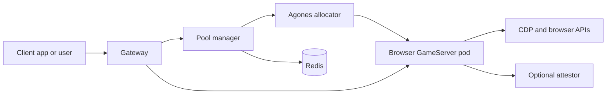

# Popcorn

Popcorn is a self-hostable browser platform for running isolated, on-demand Chromium sessions in Kubernetes. It gives each session its own ephemeral browser pod, then exposes browser view, Chrome DevTools Protocol, and session APIs through a gateway.

Popcorn OSS v1 is focused on the browser runtime platform: local deployment, Helm deployment, session lifecycle APIs, CDP access, browser images, and optional attestation docs.

## What It Runs

Popcorn is built from a few small services:

- `pool-manager`: allocates Agones GameServers, creates session records, and returns connection URLs.
- `gateway`: routes authenticated browser, CDP, API, and proof paths to the correct browser pod.
- `browser-node`: runs the browser runtime container.
- `ttl-controller`: expires sessions and shuts down old GameServers.
- `redis`: stores route and session state for the local platform.
- `browser-runtime-attestor`: optional attestation sidecar for deployments that support confidential computing.
- `popcorn-images`: a separate OSS repository for browser base images and image build assets.

The current v1 showcase is documentation, architecture, screenshots or GIF placeholders where useful, and a local demo flow. There is no hosted public demo for OSS v1.



## Repository Layout

- `services/pool-manager`: session API and Agones allocation service.
- `services/gateway`: OpenResty gateway and JWT path authorization.
- `services/browser-node`: browser runtime wrapper.
- `services/ttl-controller`: session cleanup controller.
- `services/attestor`: optional proof sidecar.
- `charts/platform`: platform Helm chart.
- `charts/browser-fleet`: browser fleet Helm chart.
- `popcorn-images`: separate OSS image repository, tracked as a submodule.
- `docs`: self-hosting, API, security, attestation, and release docs.

## Quickstart

Prerequisites:

- Docker
- Kind
- kubectl
- Helm
- Make

Clone with submodules so the browser image assets are present:

```bash
git clone --recursive https://github.com/reclaimprotocol/popcorn-oss.git
cd popcorn
```

The `reclaimprotocol/popcorn-oss` repository may remain private while release validation is in progress.

If you already cloned without submodules:

```bash
git submodule update --init --recursive
```

Expected OSS local flow:

```bash
make local-keys
make run-local-cluster
make connect
```

`make run-local-cluster` builds the local platform images used by the Kind demo.

The local gateway is expected at:

```text
http://localhost:8080
```

Create a browser session:

```bash
POPCORN_ADMIN_USER="${POPCORN_ADMIN_USER:-admin}"
POPCORN_ADMIN_PASS="${POPCORN_ADMIN_PASS:-admin}"

curl -sS -X POST http://localhost:8080/admin/session \
  -u "$POPCORN_ADMIN_USER:$POPCORN_ADMIN_PASS" \
  -H "Content-Type: application/json" \
  -d '{"sessionId":"demo-session"}'
```

`/admin/session` is the local Kind smoke-test endpoint and uses the default local admin credentials `admin:admin`.
Client `/session` usage requires analytics-backed client credentials and is documented for deployments where that auth path is configured.

The response includes:

- `url`: browser view URL.
- `cdpUrl`: restricted CDP WebSocket URL for client automation.
- `cdpInternalUrl`: full CDP WebSocket URL for trusted internal tools.
- `apiUrl`: browser runtime API URL.
- `sessionId`: the allocated session ID.

For a purely local demo, the OSS Helm example values include development credentials and local services. Do not use production credentials in a local quickstart.

## Playwright

```js
import { chromium } from "playwright";

const gateway = "http://localhost:8080";
const adminUser = process.env.POPCORN_ADMIN_USER ?? "admin";
const adminPass = process.env.POPCORN_ADMIN_PASS ?? "admin";
const response = await fetch(`${gateway}/admin/session`, {
  method: "POST",
  headers: {
    Authorization: "Basic " + Buffer.from(`${adminUser}:${adminPass}`).toString("base64"),
    "Content-Type": "application/json",
  },
  body: JSON.stringify({ sessionId: `pw-${Date.now()}` }),
});

const session = await response.json();
const browser = await chromium.connectOverCDP(session.cdpUrl);
const page = browser.contexts()[0]?.pages()[0] ?? await browser.newPage();

await page.goto("https://example.com");
console.log(await page.title());
await browser.close();
```

## Puppeteer

```js
import puppeteer from "puppeteer-core";

const gateway = "http://localhost:8080";
const adminUser = process.env.POPCORN_ADMIN_USER ?? "admin";
const adminPass = process.env.POPCORN_ADMIN_PASS ?? "admin";
const response = await fetch(`${gateway}/admin/session`, {
  method: "POST",
  headers: {
    Authorization: "Basic " + Buffer.from(`${adminUser}:${adminPass}`).toString("base64"),
    "Content-Type": "application/json",
  },
  body: JSON.stringify({ sessionId: `pptr-${Date.now()}` }),
});

const session = await response.json();
const browser = await puppeteer.connect({
  browserWSEndpoint: session.cdpUrl,
});

const page = await browser.newPage();
await page.goto("https://example.com");
console.log(await page.title());
await browser.close();
```

## Documentation

- [Docs index](docs/index.md)
- [Local Kind deployment](docs/local-kind.md)
- [Helm deployment](docs/helm-deployment.md)
- [Configuration](docs/configuration.md)
- [Secrets](docs/secrets.md)
- [Session API](docs/api.md)
- [Security model](docs/security.md)
- [Production hardening](docs/production-hardening.md)
- [Troubleshooting](docs/troubleshooting.md)
- [Attestation](docs/attestation.md)
- [Images and releases](docs/images-and-releases.md)
- [popcorn-images](popcorn-images/README.md)

## Limitations

- There is no hosted public demo for OSS v1.
- Local deployment depends on generated local JWT keys and OSS Helm example values that are landing in parallel PRs.
- Confidential-computing attestation requires compatible infrastructure and signed digest-pinned images.
- The restricted CDP endpoint currently relies on scoped gateway tokens; command-level filtering is planned but should not be treated as the primary security boundary yet.
- Root repository licensing is pending. If no root `LICENSE` file is present in your checkout, launch is blocked until the project license is added.

## Contributing

This repository is being prepared for OSS launch. Keep public docs self-hosting oriented, avoid private registries or domains in examples, and prefer local demo commands that work without hosted infrastructure.
