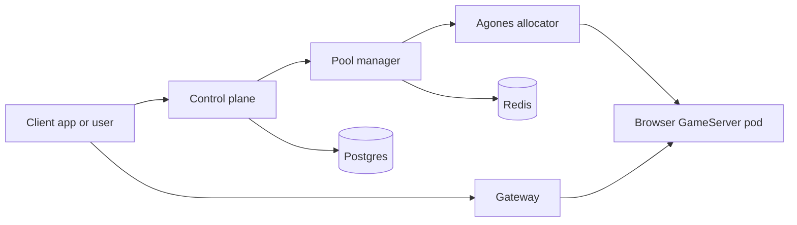

<p align="center">
  
</p>

# Popcorn

Popcorn is a self-hostable browser platform for running isolated, on-demand Chromium sessions in Kubernetes. It gives each session its own ephemeral browser pod, then exposes browser view, Chrome DevTools Protocol, and session APIs through a gateway.

The repository includes the runtime, control services, Helm charts, local Kind
workflow, GKE deployment guidance, and optional x402 and GCP attestation paths.

Clients can use either of two independent public API paths:

- the standard client API, authenticated with an operator-issued client ID and
  client secret; or
- the optional x402 API, which creates paid sessions without a Popcorn account.

Enabling x402 does not change or replace the standard client API.

## What It Runs

Popcorn is built from a few small services:

- `control-plane`: validates clients, routes new sessions across configured regions, and stores analytics.
- `pool-manager`: allocates Agones GameServers in one cluster, creates local route records, and returns connection URLs.
- `gateway`: routes authenticated live-view, CDP, optional integration API,
  and attestation paths to the correct browser pod.
- `browser-runtime`: runs Chromium and exposes its desktop over VNC/live view.
- `ttl-controller`: expires sessions and shuts down old GameServers.
- `redis`: stores route and session state for the local platform.
- `browser-runtime-attestor`: optional attestation sidecar for deployments that support confidential computing.

There is no hosted public demo; run the local Kind flow or deploy it to GKE.



## Repository Layout

- `services/pool-manager`: session API and Agones allocation service.
- `services/control-plane`: client/admin API and multi-region routing.
- `services/gateway`: OpenResty gateway and JWT path authorization.
- `images/minimal-vnc-desktop`: VNC/live-view browser runtime image.
- `services/ttl-controller`: session cleanup controller.
- `services/attestor`: optional proof sidecar.
- `charts/platform`: platform Helm chart.
- `charts/browser-fleet`: browser fleet Helm chart.
- `docs`: quickstart, deployment, configuration, operations, security, and reference docs.

## Quickstart

Install Docker, Kind, kubectl, Helm, Make, and jq, then run:

```bash
git clone https://github.com/reclaimprotocol/popcorn-oss.git
cd popcorn-oss
```

Expected OSS local flow:

```bash
make local-keys
make run-local-cluster
```

`make run-local-cluster` builds and deploys the local platform, publishing the
gateway at `http://localhost:8080` and control plane at
`http://localhost:8081`. Continue with the [Quickstart](docs/quickstart.md) for
client creation, session creation, and a Playwright smoke test.

## Documentation

- [Docs index](docs/index.md)
- [Local quickstart](docs/quickstart.md)
- [Requirements and planning](docs/prerequisites.md)
- [Production installation](docs/deployment.md)
- [Configuration](docs/configuration.md)
- [Networking](docs/networking.md)
- [Data and recovery](docs/storage.md)
- [Chart options](docs/chart-options.md)
- [Secrets](docs/secrets.md)
- [API and gateway reference](docs/reference.md)
- [Operations](docs/operations.md)
- [High availability](docs/high-availability.md)
- [Upgrades and uninstall](docs/upgrades.md)
- [Observability](docs/observability.md)
- [Security](docs/security.md)
- [Troubleshooting](docs/troubleshooting.md)
- [Browser runtime](docs/popcorn-browser.md)
- [Attestation](docs/attestation.md)
- [x402 paid-session API](docs/x402.md)
- [MPP and x402 payment client guide](docs/x402-client.md)
- [Images and releases](docs/images-and-releases.md)
- [Third-party software notices](THIRD_PARTY_NOTICES.md)

## Limitations

- There is no hosted public demo.
- Production deployment support is GCP/GKE only for now.
- Local deployment depends on generated local JWT keys and development-only Helm values.
- Confidential-computing attestation requires compatible GCP infrastructure and signed digest-pinned images.
- The restricted CDP endpoint applies a command allowlist, but filtering should
  not be treated as the only security boundary; scoped path tokens, ownership,
  and short session lifetimes remain required.

## Contributing

Keep public docs oriented around local Kind and GCP/GKE deployment, avoid private registries or domains in examples, and prefer commands that can be reproduced from a fresh clone.
