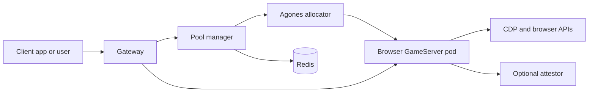

# Popcorn

Popcorn is a self-hostable browser platform for running isolated, on-demand Chromium sessions in Kubernetes. It gives each session its own ephemeral browser pod, then exposes browser view, Chrome DevTools Protocol, and session APIs through a gateway.

Popcorn OSS v1 is focused on the browser runtime platform: local Kind development, GCP/GKE deployment, session lifecycle APIs, CDP access, browser images, and optional GCP attestation docs.

## What It Runs

Popcorn is built from a few small services:

- `control-plane`: validates clients, routes new sessions across configured regions, and stores analytics.
- `pool-manager`: allocates Agones GameServers in one cluster, creates local route records, and returns connection URLs.
- `gateway`: routes authenticated browser, CDP, API, and proof paths to the correct browser pod.
- `browser-node`: runs the browser runtime container.
- `ttl-controller`: expires sessions and shuts down old GameServers.
- `redis`: stores route and session state for the local platform.
- `browser-runtime-attestor`: optional attestation sidecar for deployments that support confidential computing.
- `popcorn-images`: a separate OSS repository for browser base images and image build assets.

There is no hosted public demo for OSS v1; run the local Kind flow or deploy it to GKE.



## Repository Layout

- `services/pool-manager`: session API and Agones allocation service.
- `services/gateway`: OpenResty gateway and JWT path authorization.
- `services/browser-node`: browser runtime wrapper.
- `services/ttl-controller`: session cleanup controller.
- `services/attestor`: optional proof sidecar.
- `charts/platform`: platform Helm chart.
- `charts/browser-fleet`: browser fleet Helm chart.
- `popcorn-images`: separate OSS image repository, tracked as a submodule.
- `docs`: quickstart, deployment, configuration, operations, security, and reference docs.

## Quickstart

Prerequisites on your local machine:

- Docker Engine or Docker Desktop, running locally, with BuildKit enabled
- Kind
- kubectl
- Helm
- Make
- jq

Clone with submodules so the browser image assets are present:

```bash
git clone --recursive https://github.com/reclaimprotocol/popcorn-oss.git
cd popcorn-oss
```

If you already cloned without submodules:

```bash
git submodule update --init --recursive
```

Expected OSS local flow:

```bash
make local-keys
make run-local-cluster
```

`make run-local-cluster` builds the local platform images, creates or updates
the Kind cluster, deploys Popcorn, and publishes the local ports. `make connect`
is optional and only prints the local endpoint reminder.

The local gateway is expected at:

```text
http://localhost:8080
```

Create a browser session:

```bash
CONTROL_PLANE_URL=http://localhost:8081
CONTROL_PLANE_ADMIN_TOKEN=local_admin_token_for_dev

CLIENT_JSON=$(curl -sS -X POST "$CONTROL_PLANE_URL/admin/clients" \
  -H "Authorization: Bearer $CONTROL_PLANE_ADMIN_TOKEN" \
  -H "Content-Type: application/json" \
  -d '{"name":"demo client"}')

export CLIENT_ID=$(printf '%s' "$CLIENT_JSON" | jq -r .clientId)
export CLIENT_SECRET=$(printf '%s' "$CLIENT_JSON" | jq -r .clientSecret)

curl -sS -X POST "$CONTROL_PLANE_URL/v1/sessions" \
  -H "Authorization: Bearer $CLIENT_ID:$CLIENT_SECRET" \
  -H "Content-Type: application/json" \
  -d '{"sessionId":"demo-session","regions":["local"]}'
```

Client session creation uses the control-plane `/v1/sessions` API. See
[Reference](docs/reference.md) for the client credential workflow and response
shape.

The response includes:

- `url`: browser view URL.
- `cdpUrl`: restricted CDP WebSocket URL for client automation.
- `cdpInternalUrl`: full CDP WebSocket URL for trusted internal tools.
- `apiUrl`: browser runtime API URL.
- `sessionId`: the allocated session ID.

For a purely local demo, the OSS Helm example values include development credentials and local services. Do not use production credentials in a local quickstart.

## Playwright

```js
import { chromium } from "playwright";

const controlPlaneUrl = process.env.CONTROL_PLANE_URL ?? "http://localhost:8081";
const clientId = process.env.POPCORN_CLIENT_ID;
const clientSecret = process.env.POPCORN_CLIENT_SECRET;
const response = await fetch(`${controlPlaneUrl}/v1/sessions`, {
  method: "POST",
  headers: {
    Authorization: `Bearer ${clientId}:${clientSecret}`,
    "Content-Type": "application/json",
  },
  body: JSON.stringify({ sessionId: `pw-${Date.now()}`, regions: ["local"] }),
});

const session = await response.json();
const browser = await chromium.connectOverCDP(session.cdpUrl);
const page = browser.contexts()[0]?.pages()[0] ?? await browser.newPage();

await page.goto("https://example.com");
console.log(await page.title());
await browser.close();
```

## Puppeteer

```js
import puppeteer from "puppeteer-core";

const controlPlaneUrl = process.env.CONTROL_PLANE_URL ?? "http://localhost:8081";
const clientId = process.env.POPCORN_CLIENT_ID;
const clientSecret = process.env.POPCORN_CLIENT_SECRET;
const response = await fetch(`${controlPlaneUrl}/v1/sessions`, {
  method: "POST",
  headers: {
    Authorization: `Bearer ${clientId}:${clientSecret}`,
    "Content-Type": "application/json",
  },
  body: JSON.stringify({ sessionId: `pptr-${Date.now()}`, regions: ["local"] }),
});

const session = await response.json();
const browser = await puppeteer.connect({
  browserWSEndpoint: session.cdpUrl,
});

const page = await browser.newPage();
await page.goto("https://example.com");
console.log(await page.title());
await browser.close();
```

## Documentation

- [Docs index](docs/index.md)
- [Quickstart](docs/quickstart.md)
- [Deployment](docs/deployment.md)
- [Configuration](docs/configuration.md)
- [Secrets](docs/secrets.md)
- [Reference](docs/reference.md)
- [Operations](docs/operations.md)
- [Security](docs/security.md)
- [Troubleshooting](docs/troubleshooting.md)
- [Attestation](docs/attestation.md)
- [Images and releases](docs/images-and-releases.md)
- [popcorn-images](popcorn-images/README.md)

## Limitations

- There is no hosted public demo for OSS v1.
- Production deployment support is GCP/GKE only for now.
- Local deployment depends on generated local JWT keys and development-only Helm values.
- Confidential-computing attestation requires compatible GCP infrastructure and signed digest-pinned images.
- The restricted CDP endpoint currently relies on scoped gateway tokens; command-level filtering is planned but should not be treated as the primary security boundary yet.

## Contributing

Keep public docs oriented around local Kind and GCP/GKE deployment, avoid private registries or domains in examples, and prefer commands that can be reproduced from a fresh clone.
