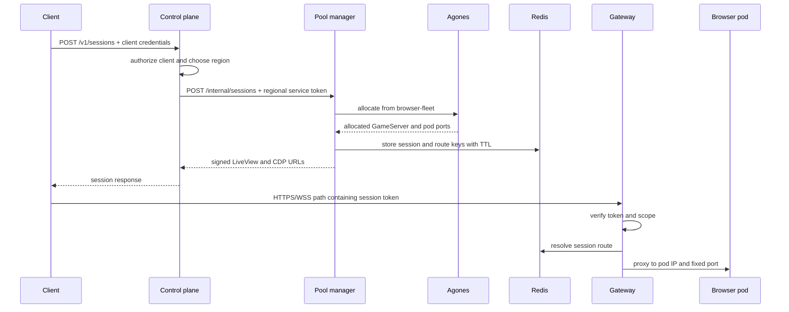

# Architecture

Popcorn separates session admission, regional allocation, and browser traffic.
The control plane never proxies browser bytes, and the gateway never chooses a
region.

## Components

| Component | Responsibility | State |
| --- | --- | --- |
| Control plane | client/admin authentication, region selection, durable session metadata | Postgres |
| Pool manager | allocate/delete Agones GameServers, sign session URLs, publish routes | Redis and Kubernetes API |
| Gateway | validate path tokens and proxy LiveView, CDP, proof, and extension traffic | Redis route lookups and short local cache |
| Agones | Fleet reconciliation, GameServer lifecycle, allocation | Kubernetes API |
| Browser runtime | Chromium, LiveView, restricted and internal CDP proxies | ephemeral pod filesystem |
| TTL controller | delete expired GameServers and report lifecycle completion | Kubernetes API and control-plane callback |
| Redis | active session objects, route targets, route-bound access deadlines | short-lived operational state |
| Postgres | clients, session records, lifecycle and optional x402 metadata | durable state |

## Credentialed session flow



The returned URLs are bearer credentials. The gateway validates the signed
token before using the Redis route.

## Browser routing

Agones reports fixed pod ports because every Popcorn GameServer port uses
`portPolicy: None`. The pool manager writes routes such as:

```text
route:liveview:<session-id>    -> <pod-ip>:6080
route:cdp:<session-id>         -> <pod-ip>:9222
route:cdp-internal:<session-id>-> <pod-ip>:9226
```

Optional session extensions add their own route keys. The browser pods are not
published with Services or NodePorts.

## Authentication boundaries

Popcorn uses distinct credentials for distinct hops:

- client ID and client secret: client to credentialed control-plane API;
- admin login or token: operator to `/admin`;
- pool-manager service token: control plane to one regional pool manager;
- control-plane service token: internal lifecycle callbacks;
- signed path token: client to one gateway route and session;
- optional route-bound automation capability: x402 session automation;
- Kubernetes ServiceAccounts: controllers to Kubernetes and Agones APIs.

Do not reuse one credential across boundaries.

## Session lifecycle

1. The control plane validates client access to the requested cluster/region.
2. The pool manager asks Agones for a Ready GameServer.
3. The pool manager records the active session and route TTLs in Redis.
4. The control plane records the session in Postgres and returns signed URLs.
5. The client uses the gateway; no direct browser pod access is required.
6. TTL extension updates the control plane, GameServer metadata, token/access
   deadline, and Redis route TTLs.
7. Explicit deletion or TTL cleanup removes the GameServer and live routes and
   reports terminal state.

If a process fails midway, the authoritative stores differ by phase. Operators
should use the supported lifecycle APIs and TTL cleanup rather than editing
Redis and Postgres independently.

## Deployment topology

### Single region

One control plane, pool manager, gateway, Redis, Postgres, and browser Fleet
serve one region. This is the simplest production shape.

### Multiple regions

A control plane may reference multiple regional pool managers and public
gateway origins. Each region owns its Fleet, route Redis, and pool-manager
service token. The control plane tries requested enabled regions in order.

Regional failure should not require sharing Redis across regions. Postgres is
the durable control-plane data store and needs its own regional/disaster
recovery design.

### Dedicated x402 region

When enabled, x402 uses an explicit `x402Only` region. Credentialed clients do
not fall back into it, and paid sessions do not fall back into normal regions.
See [x402 API](x402.md).

## Kubernetes objects

The platform chart creates Deployments and Services for core services, a
pre-upgrade database migration Job, RBAC, optional GKE Ingress resources,
optional Redis, TTL cleanup, and OTEL components.

The browser chart creates an Agones Fleet and FleetAutoscaler plus optional
ServiceAccount/RBAC, image pre-puller, NetworkPolicy, confidential-computing
device plugin, and ExternalSecret resources.

## Failure behavior

| Failure | Immediate effect |
| --- | --- |
| One browser pod | that session ends; Fleet replaces capacity |
| Gateway replica | connections on that replica close; new traffic uses healthy replicas |
| Pool manager | no new allocation/deletion in that region; existing gateway routes may continue |
| Redis | gateway route resolution and allocation state fail |
| Control plane | no client/admin lifecycle operations; existing signed gateway routes may continue until expiry |
| Postgres | control-plane operations and migrations fail |
| Agones controller | Fleet/GameServer reconciliation and new allocation fail |

Availability depends on replicas and data-store design; see
[High availability](high-availability.md).

## Trust model

Browser pods execute untrusted web content and should be treated as hostile
workloads. They are disposable, resource-limited, network-constrained where
possible, and separated from durable state. The gateway is the public trust
enforcement point for browser routes. The control plane is the identity and
ownership enforcement point for session lifecycle operations.

Continue with [Security](security.md) for production controls and
[Browser runtime](popcorn-browser.md) for the worker internals.
