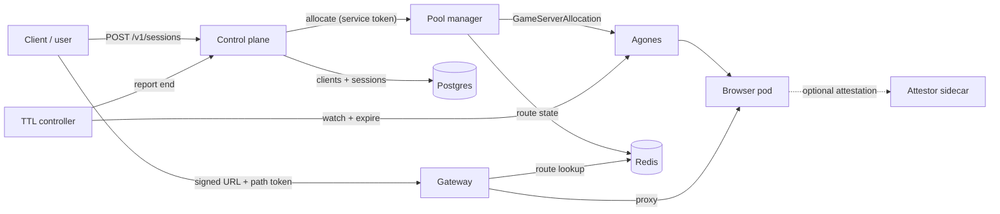
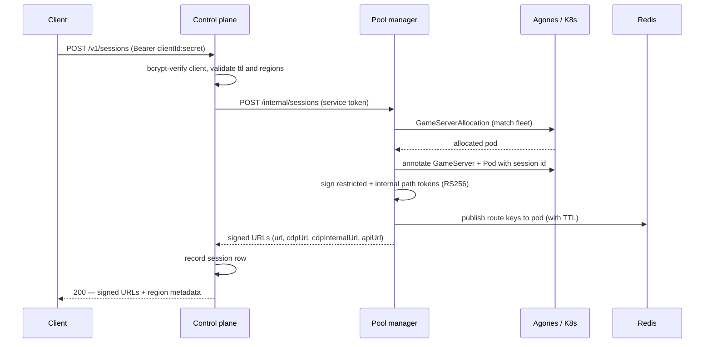

# Popcorn Architecture

> Companion document: [The Popcorn Browser](popcorn-browser.md).

Popcorn is a self-hostable platform for running isolated, on-demand Chromium sessions on
Kubernetes. Every session gets its own ephemeral browser pod; clients reach that browser —
its live view, its Chrome DevTools Protocol (CDP) endpoint, and a runtime API — through a
single gateway using short-lived, signed, per-session URLs.

This document explains how the platform works internally: the services it is built from,
how a session is created and reached, how requests are authorized, and where state lives.
It is a reference to the system's mechanics — it describes what the system does, not whether
any given behavior is desirable; guarantees and hardening are covered in separate follow-up
documents. Operator-facing guidance (quickstart, deployment, hardening checklist) lives in
[`docs/`](index.md), one level above this reference.

> Source references appear as `file:line` at the end of each section, so this document
> doubles as a map into the codebase.

---

## Architecture at a glance

A Popcorn deployment is a small control plane in front of a fleet of disposable browsers.

Clients never speak to a browser directly, and they never manage infrastructure. A client
asks the **control plane** for a session; the control plane selects a region and asks that
region's **pool manager** to allocate one; the pool manager claims a browser pod from an
**Agones** fleet, mints the signed URLs the client will use, and records where the pod
lives. From then on the client talks only to the **gateway**, which validates each request
and proxies it to the correct pod. A **TTL controller** removes sessions when they expire.

The pieces that make this work:

| Component | Stack | Responsibility |
| --- | --- | --- |
| **Control plane** | TypeScript · Bun · Hono | The client and admin API. Authenticates clients, selects a region, orchestrates session creation, and stores session and analytics records in Postgres. |
| **Pool manager** | TypeScript · Bun · Hono | A per-region allocator. Claims Agones GameServers, mints per-session path tokens, and writes routing state to Redis. |
| **Gateway** | OpenResty (nginx + Lua) | The public entry point. Verifies path tokens, resolves the target pod from Redis, and proxies browser, CDP, API, and proof traffic. |
| **Browser runtime** | Chromium · VNC · Go | The browser that runs inside each GameServer pod. |
| **TTL controller** | Go · controller-runtime | Expires sessions by deleting Agones GameServers and reporting back to the control plane. |
| **Attestor** | Go | Optional confidential-computing proof sidecar in each browser pod. |
| **Redis** | — | Live session-to-pod routing state. |
| **Postgres** | — | Control-plane clients, sessions, and analytics. |

---

## The session lifecycle

Two operations drive almost everything in Popcorn: **creating** a session and
**connecting** to it. The rest of the platform follows from these.

### Creating a session

A client authenticates to the control plane and asks for a session. The control plane
validates the request, chooses a region, and delegates allocation to that region's pool
manager. The pool manager performs the allocation — it claims a browser pod, mints the
tokens, and publishes the routes — then returns a set of signed URLs that the control plane
records and passes back to the client.

**In the control plane**, `POST /v1/sessions` authenticates the caller with its
`clientId:clientSecret` (bcrypt-compared against the stored hash), validates the request —
an optional `sessionId` must match `^[A-Za-z0-9_-]{1,64}$`, and `ttlSeconds` must be a
positive integer no larger than `SESSION_MAX_TTL_SECONDS` (default 900) — and selects a
region. If the caller names no region, every enabled region is tried in configured order.
The control plane then calls the chosen region's pool manager with a shared service bearer
token and, on success, writes a `sessions` row before returning. The **first region that
allocates wins**; if the local record write fails afterward, the control plane rolls back
by deleting the freshly allocated session.

*Source: `services/control-plane/index.ts:324-386,591-598`; region selection
`src/regions.ts:16-45`; outbound call `src/pool-manager.ts:37-99`.*

**In the pool manager**, allocation (`allocateSessionLocally`) validates or generates the
session id, guards against duplicates in Redis, and issues a `GameServerAllocation` against
the configured Agones fleet. It annotates both the GameServer and the Pod with the session
id for correlation — Pod annotation is mandatory, and a failure aborts the allocation so
logs always tie back to a session. It resolves the pod IP (ports use Agones `portPolicy:
None`, so traffic targets the pod directly), mints the path tokens, publishes the routes to
Redis, and emits analytics. Any failure after allocation triggers compensating cleanup: the
Redis record is removed and the GameServer is shut down.

*Source: `services/pool-manager/index.ts:194-303`; Agones `src/services/agones.ts:59-163`;
Kubernetes `src/services/k8s.ts:66-165`.*

### Connecting to a session

The client receives four signed URLs and, from here on, talks only to the gateway. For each
request the gateway extracts the session id and token from the URL path, verifies the token,
resolves the target pod from Redis, and proxies the connection — HTTP, WebSocket, or CDP.

1. **Verify the token.** The RS256 signature is checked with the public key; the token's
   scope (when the route requires one) and its `sub` (which must equal the path session id)
   are enforced.
2. **Resolve the pod.** The target `host:port` is read from Redis under `route:*:<sessionId>`,
   cached in-worker for two seconds.
3. **Proxy.** The request is passed through to the pod.

Every client interaction — the browser view, the VNC live-view stream, CDP, and the runtime
API — reaches the pod this way, through the gateway. There is no direct client-to-pod
connection. (See [Browser networking](#browser-networking) for the live-view path in
detail.)

*Source: `services/gateway/nginx.conf`, `services/gateway/auth.lua`.*

### Ending a session

Sessions end in one of two ways. A client can `DELETE` its own session, or the TTL
controller can expire it. The controller watches Agones GameServers, reads an expiry from
their annotations, and when a session is past due it reports the end to the control plane
and deletes the GameServer. Redis routes carry their own TTL and lapse independently, so a
missed cleanup still stops routing once the token and route expire.

*Source: `services/ttl-controller/controller.go:56-119`.*

---

## Components

### Control plane

The control plane is the front door for clients and operators. It is a single Hono
application exposing four surfaces, each with its own authentication model:

- **Client API (`/v1/*`)** — create, fetch, delete, and extend sessions. Callers
  authenticate with `Authorization: Bearer <clientId>:<clientSecret>`. Every session is
  owned by the client that created it; acting on someone else's session returns `404`
  rather than `403`, so the API never reveals whether a session exists.
- **Service API (`POST /sessions/:id/end`)** — how the TTL controller reports expirations.
  Authenticated with the service token.
- **Admin API and UI (`/admin/*`)** — session and client management, plus an HTMX console.
- **Health (`/health`)** — unauthenticated.

**Client credentials.** A client id is `client_` + 8 random bytes; a secret is `secret_` +
32 random bytes. Only a bcrypt hash of the secret is stored (cost 10); the plaintext is
returned exactly once, at creation.

**Admin authentication** supports three strategies, tried in order: a static bearer token
(constant-time compared), HTTP Basic against a bcrypt htpasswd file (or legacy plaintext
credentials), and a signed session cookie. The cookie is an HMAC-SHA256-signed — not
encrypted — payload carrying identity, strategy, and expiry. For interactive strategies,
state-changing requests must be same-origin (`Origin`/`Referer` checked against the host);
machine callers using the bearer token bypass that check. Google OAuth is supported as an
additional interactive path, gated on a verified email against an allow-list.

**Data model.** Three tables: `clients` (id, name, bcrypt secret hash, active flag),
`sessions` (id, owning client, cluster, region, timestamps, status, and a JSON metadata
blob holding `expiresAt`), and `session_events` — an audit table defined in the schema but
not currently written by any code path. Seed migrations create built-in `anonymous`,
`legacy`, and `admin` client rows with empty secret hashes, which cannot authenticate over
`/v1/*` because bcrypt never matches an empty hash.

*Source: `services/control-plane/index.ts`, `src/clients.ts`, `src/admin-auth.ts`,
`src/schema.ts`, `migrations/`.*

### Pool manager

The pool manager is the per-region allocator, and it is the only component that both talks
to Kubernetes and mints tokens. Every functional route sits under `/internal/*` and is
guarded by a single shared bearer token (`POOL_MANAGER_SERVICE_AUTH_TOKEN`); the only
unauthenticated route is `/health`. The `clientId` and `clientName` in an allocation
request are treated as labels for correlation, not as authenticated identities.

It reaches Kubernetes with its in-cluster service account, scoped by a **namespaced** Role
(`pod-killer`) that grants allocation of GameServers and management of the pods behind
them. Browser ports are fixed in code rather than read back from Agones: `http:8082`,
`cdp:9222`, `kernel-api:10001`, plus any operator-configured extras.

*Source: `services/pool-manager/index.ts:48-74,194-303`, `charts/platform/templates/rbac.yaml`.*

### Gateway

The gateway is where authorization actually happens on the request path. It is OpenResty —
nginx with a small Lua module — and it never issues tokens; it only verifies them. It holds
the RSA *public* key; the pool manager holds the private key. This asymmetric split means a
compromise of the gateway cannot mint new access.

Every route follows the same shape: `/{kind}/<sessionId>/<token>/...`. The gateway resolves
the destination pod **entirely from Redis, keyed by session id** — the human-readable pod
segment in some URLs is cosmetic. Each route names the token scope it requires:

| Route | Required scope | Proxies to |
| --- | --- | --- |
| Browser view `/(browser…)/<s>/<token>/…` | none | pod main port |
| Client CDP `/cdp/<s>/<token>/…` | none | pod CDP port |
| Full-access CDP `/cdp-internal/<s>/<token>/…` | `internal` | pod full-CDP port |
| Runtime API `/api/<s>/<token>/…` | `internal` | pod kernel-API port |
| Live view WS `/(liveview-ws\|vnc-ws)/<s>/<token>/` | none | pod noVNC `/websockify` |
| Proof `/proof/<s>/…` | *no token check* | attestor sidecar `:8085` |
| Catch-all `/` | *none at gateway* | pool manager |

Token verification is three checks: the RS256 signature against the public key; the token
scope, by exact-string match, when the route requires one; and that the token's `sub`
equals the session id in the path, which binds a token to a single session. Expiry is
enforced by the JWT library's default validators. The proof route is deliberately
token-free — it is reachable by session id alone — and the catch-all forwards to the pool
manager, whose own auth applies.

There is no CDP command-level filtering in the gateway; both CDP routes are transparent
proxies, distinguished only by the required scope and the pod port they reach.

*Source: `services/gateway/auth.lua:30-73`, `services/gateway/nginx.conf`.*

### Browser runtime

Each GameServer pod runs a browser. The runtime in use is the **Popcorn Browser**
(`images/minimal-vnc-desktop/`) — a self-contained image built around a hardened Chromium
("Tilion Fortress"), streamed to the client over **VNC / live view**. It is what the
`browser-runtime` image is built from, and it is the streaming mode Popcorn runs in.

Inside the Popcorn Browser, Chromium runs headed under a virtual X display; a Go helper
(`novnc-proxy`) streams the framebuffer to the client over a WebSocket and fronts the
browser's control surfaces. Chromium's DevTools endpoint is bound to localhost, and the
helper exposes a restricted CDP port (a WebSocket command allow-list), a full-access CDP
port (unfiltered), and a Reclaim proof API. The process runs as a non-root `kernel` user,
and Chromium's own sandbox is disabled (`--no-sandbox`), so isolation rests on the
container and pod boundary. The VNC streaming path is described in
[Browser networking](#browser-networking).

> A dedicated deep dive on the Popcorn Browser — its build, boot sequence, ports, the
> Fortress engine, the CDP allow-list, and the proxy extension — is in
> [`popcorn-browser.md`](popcorn-browser.md).

*Source: `images/minimal-vnc-desktop/`, `charts/browser-fleet/templates/fleet.yaml`.*

### TTL controller

The TTL controller is a controller-runtime manager that reconciles Agones GameServers to
enforce session lifetime. It acts only on `Allocated` servers, and it takes the expiry from
the GameServer's own annotations: an explicit `popcorn.dev/expires-at` if present,
otherwise the Agones allocation time plus a configured default TTL. When a session is past
due, it reports the end to the control plane (fire-and-forget) and deletes the GameServer;
servers that are not yet due are requeued for exactly their remaining lifetime. Its RBAC is
a ClusterRole granting watch and delete over GameServers plus leader-election leases.

*Source: `services/ttl-controller/controller.go`, `analytics.go`.*

### Attestor

The attestor is an optional sidecar for deployments on confidential-computing
infrastructure. It runs alongside the browser in each pod, exposes `GET /proof?nonce=…`, and
produces a proof that binds a caller-supplied nonce to the running workload.

Building a proof, it reads its own Pod and Node to resolve the image digests of the browser
and attestor containers, verifies both digests against a pinned cosign public key, and then
requests a GCP Confidential Computing attestation. That request carries a vTPM quote and,
critically, a nonce field containing both the caller's nonce and a SHA-256 *digest binding*
over the workload and verifier image digests. The result is a GCP-signed OIDC token. The
proof JSON wraps that token together with the plaintext digests; the only cryptographic
signature over the proof is GCP's, and the plaintext fields are trustworthy only insofar as
a verifier recomputes the digest binding and checks it against the token's nonce claim.

*Source: `services/attestor/main.go`; see also [`docs/attestation.md`](attestation.md).*

---

## The session token model

The signed path token is the heart of Popcorn's request authorization, so it is worth
understanding on its own.

Tokens are **minted by the pool manager and verified by the gateway**. The pool manager
signs with an RSA private key; the gateway holds only the matching public key. A token is a
compact RS256 JWT with two meaningful claims — `sub`, the session id, and `scope`, one of
`restricted` or `internal` — plus a standard expiry. It carries no audience, issuer, or
unique id. By default it lives for 24 hours, or until the session's `expiresAt` if that is
sooner.

The pool manager issues **two tokens per session** and embeds them directly in the URLs it
returns:

| URL | Grants | Scope |
| --- | --- | --- |
| `url` — the browser view | View the session | `restricted` |
| `cdpUrl` — client CDP | Client-facing DevTools | `restricted` |
| `cdpInternalUrl` — full-access CDP | Full DevTools control | `internal` |
| `apiUrl` — runtime API | Runtime/kernel API | `internal` |

The browser view and client CDP share one `restricted` token; full-access CDP and the
runtime API share one `internal` token. The gateway enforces the required scope per route
and binds every token to its session. A URL is a bearer credential: anyone holding a live
one can use that route until the token expires or the Redis route lapses.

> **A note on naming.** The `cdpInternalUrl` field and the `/cdp-internal/` route are
> legacy names: the `internal` scope grants *full-access* CDP — complete control of the
> browser — and is exposed intentionally as part of the product. The field name predates
> that framing; read "internal" as "full-access" throughout.

*Source: `services/pool-manager/src/services/auth.ts:31-39`, `index.ts:157-192`.*

---

## State

Popcorn keeps three kinds of state, each with a distinct role and lifetime.

**Redis — live routing.** For each session the pool manager writes a set of route keys —
`route:<id>`, `route:cdp:<id>`, `route:api:<id>`, `route:cdp-internal:<id>`, and any extras
— each mapping to a pod `host:port` and each carrying a TTL (time until `expiresAt`, or 24
hours by default). The gateway reads these keys verbatim to choose where to proxy, with a
two-second in-worker cache, so route changes take effect within seconds. Redis also holds a
`sessions` hash of per-session metadata, which does not itself expire.

**Postgres — control-plane records.** The `clients`, `sessions`, and (unused)
`session_events` tables described above. This is the durable record of who owns what.

**ClickHouse / OpenTelemetry — analytics.** Optionally, the pool manager records a session
binding row and emits `session.start` / `session.end` events. These carry infrastructure
identifiers only — session id, cluster, namespace, pod name and uid, region — not browsed
URLs, tokens, or end-user data.

*Source: `services/pool-manager/src/services/db.ts:60-109`, `src/session-ttl.ts`,
`src/services/clickhouse.ts`, `src/services/otel.ts`.*

---

## Deployment topology

Popcorn ships as two Helm releases into a single namespace, with Agones installed
separately at the cluster level. The intended exposure is deliberately narrow: the gateway
is the one component meant to be public, the control plane may be public if clients create
sessions directly, and everything else — pool manager, Redis, Postgres — stays internal.
Browser pods have no public surface of their own; all client traffic reaches them through
the gateway.

| Component | Kind | Default exposure |
| --- | --- | --- |
| Gateway | Deployment + Service | Public (LoadBalancer, or ClusterIP behind a GKE Ingress) |
| Control plane | Deployment + Service | Internal by default; optionally public via Ingress |
| Pool manager | Deployment + Service | Internal only |
| Redis | Deployment + Service | Internal only |
| Postgres | External | Managed / internal |
| TTL controller | Deployment + ClusterRole | No inbound surface |
| Browser fleet | Agones Fleet | Gateway-proxied only (no public surface) |
| Attestor | Sidecar | Reached via the gateway proof route |

TLS is terminated at the GKE L7 Ingress via a managed certificate, which is provisioned only
when both a static IP and a domain are configured; the gateway and control-plane pods
themselves serve plaintext behind it. The charts define no NetworkPolicies, so internal
reachability is governed by Service type rather than by network policy.

**Browser pods** run with a `SYS_ADMIN` capability and an `fsGroup` set for log-directory
ownership; the image itself runs as the non-root `kernel` user. Chromium's own sandbox is
off, so the container and pod form the isolation boundary. Node-pool isolation for the
fleet is left to cluster configuration rather than enforced by the chart.

*Source: `charts/platform/`, `charts/browser-fleet/`; see [`docs/deployment.md`](deployment.md).*

---

## Browser networking

Popcorn streams the browser to the client over **VNC / live view**, and everything a client
touches goes through the gateway. There is no direct client-to-pod connection.

**The live-view path.** Inside the pod, Chromium renders to a virtual X display served by a
local VNC server (`Xvnc`, bound to `127.0.0.1:5900`, so nothing reaches VNC except from
inside the pod). The Go helper bridges that VNC socket to a WebSocket on port `6080`
(`/websockify`), and the gateway proxies the client's `/liveview-ws/<sessionId>/<token>`
connection to it. In the browser, a small noVNC client (`liveview.html`) renders the
framebuffer onto a canvas and sends input back over the same socket. The whole path is
WebSocket over the gateway's TCP proxy; the pod is never exposed to the client directly.

**Everything else** — the browser view, CDP, and the runtime API — reaches the client the
same way, as HTTP or WebSocket through the gateway. The container ports (`http:8082`,
`novnc:6080`, `cdp:9222`, `cdp-internal:9226`, `kernel-api:10001`) all use Agones
`portPolicy: None`, so they are reachable only via the gateway proxying to the pod IP, never
published on the node.

**Egress through a per-session proxy.** Outbound traffic is routed through an upstream proxy
applied *inside Chromium* by a bundled extension, not by container network configuration.
The extension sets `chrome.proxy.settings` to a single fixed upstream (scheme, host, port,
with a localhost bypass), persists it, and re-applies it whenever the service worker
restarts. The upstream is assigned at runtime by the platform — either through the
page-level `window.__pcn` API the extension exposes, or over CDP — while the proxy
*credentials* are supplied out of band over CDP (the `Fetch` domain), so they never live in
the extension or the page. A fleet-wide `HTTPS_PROXY_URL` is available as a static fallback.
A few boot-time calls (the geo-IP lookup and the Reclaim TEE endpoints) egress directly, and
the charts impose no egress policy on browser pods. The extension mechanics are detailed in
[The Popcorn Browser](popcorn-browser.md#the-proxy-extension).

*Source: `images/minimal-vnc-desktop/` (`entrypoint.sh`, `liveview.html`, `proxy/main.go`,
`extensions/proxy/`), `charts/browser-fleet/templates/fleet.yaml`; see
[`docs/networking.md`](networking.md).*

---

## Secrets

Popcorn's secrets fall into a handful of groups. The charts reference them by name only;
values are supplied either as Kubernetes Secrets or through the External Secrets Operator
syncing from a cloud secret manager.

| Secret | Holds | Used by |
| --- | --- | --- |
| `gateway-jwt-keys` | RSA private + public key | Pool manager (private), gateway (public) |
| `pool-manager-service-auth` | Service bearer token | Control plane, pool manager |
| `control-plane-secret` | Service token, admin credentials, session secret, OAuth | Control plane, TTL controller |
| `analytics-db-secret` | Postgres connection | Control plane, migrations |
| `browser-runtime-proxy-secret` | Upstream egress proxy URL | Browser runtime |
| `otel-*` | Telemetry export + ClickHouse credentials | OTel agent, pool manager |

The two keys worth calling out are the **JWT key pair**, which underpins the entire token
model — the pool manager signs with the private half, the gateway verifies with the public
half — and the **service bearer token**, which is the sole credential between the control
plane and pool managers.

*Source: [`docs/secrets.md`](secrets.md), `charts/platform/templates/`.*

---

## Trust boundaries

Pulling the threads together, these are the boundaries the current implementation draws:

1. **Client → control plane.** A bcrypt-verified `clientId:clientSecret`. Sessions are
   owned by the creating client.
2. **Control plane → pool manager.** A shared service bearer token (global, or per region).
3. **Pool manager → Kubernetes.** A namespaced service-account Role.
4. **Client → gateway.** An RS256 path token, scope-checked per route and bound to one
   session — with the proof route as a deliberate exception that performs no token check.
5. **Gateway → pod.** The gateway trusts Redis route values to select the proxy target.
6. **TTL controller → control plane.** A service bearer token; expiry is driven by
   GameServer annotations.
7. **Inside the browser pod.** Untrusted, user-driven web content runs as a non-root user
   with Chromium's sandbox disabled; the container and pod are the isolation boundary, with
   optional confidential-computing attestation available on top.

---

## Glossary

| Term | Meaning |
| --- | --- |
| **Control plane** | The client and admin API. Authenticates clients, selects a region, orchestrates session creation, and stores records in Postgres. |
| **Pool manager** | A per-region allocator. Claims Agones GameServers, mints per-session path tokens, and writes routing state to Redis. |
| **Gateway** | The public entry point (OpenResty). Verifies path tokens, resolves the target pod from Redis, and proxies traffic. |
| **Popcorn Browser** | The browser runtime image (`images/minimal-vnc-desktop/`) that runs in each session pod, streamed over VNC / live view. |
| **GameServer** | An Agones-managed pod holding one browser session. Allocated on demand, deleted on expiry. |
| **Path token** | A short-lived RS256 JWT embedded in a session URL. Carries a session id (`sub`) and a scope; verified by the gateway on every request. |
| **`restricted` scope** | The token scope for the browser view and client-facing CDP. |
| **`internal` scope** | The token scope for **full-access CDP** and the runtime API — complete control of the browser. The `cdpInternalUrl` / `/cdp-internal/` names are legacy; read "internal" as "full-access". |
| **Route keys** | Redis entries (`route:*:<sessionId>`) mapping a session to its pod `host:port`. The gateway reads these to decide where to proxy. |
| **TTL controller** | Expires sessions by deleting Agones GameServers past their TTL and reporting the end to the control plane. |
| **Attestor** | Optional confidential-computing sidecar that produces a signed proof binding a caller nonce to the running workload's image digests. |

---

## Related documents

- [The Popcorn Browser](popcorn-browser.md) — the browser runtime image in depth.
- [Documentation index](index.md) — operator documentation.
- [Security](security.md) — operator self-hosting hardening checklist.
- [Attestation](attestation.md) — confidential-computing proof flow.
- [Networking](networking.md) — how the browser streams over VNC / live view.
- [Reference](reference.md) — session API and gateway path reference.

**Planned follow-ups.** Two documents build directly on this one: a **security guarantees**
overview of what Popcorn does and does not guarantee today, and a **hardening roadmap** for
meeting a defined security bar.
