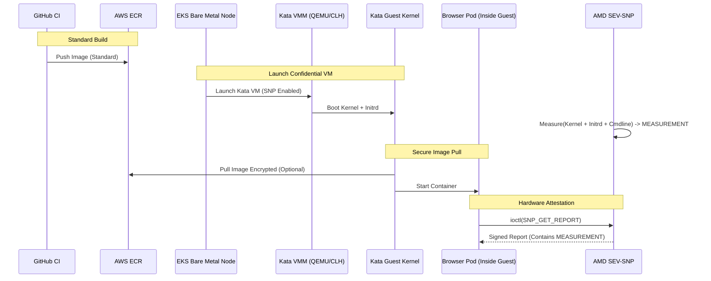

# Attestation Strategy: Kata Containers + Confidential Containers (CoCo)

> [!IMPORTANT]
> This strategy provides the **strongest possible guarantee** (Hardware-Rooted Attestation) by measuring the container workload itself. It requires significant infrastructure changes (Bare Metal Nodes, specific AMIs, Custom RuntimeClass).

## Overview

The goal is to cryptographically prove that the *specific container image* is running inside a secure, isolated environment without relying on trust in the host operating system or container runtime.

### Trust Model
1.  **Trust Only the Hardware (AMD SEV-SNP)**: To measure the Guest VM and sign the report.
2.  **No Trust in Node**: An attacker with root on the EKS Node **cannot** see inside the Guest VM memory or forge the Guest measurement.

## Architecture



## Setup Guide (High Level)

### 1. Infrastructure Requirements
*   **Instance Type**: You must use **Standard Metal Instances** (e.g., `c6a.metal`) or instances that support nested virtualization if allowed. SEV-SNP requires specific AMD EPYC processors (Milan or newer).
*   **Host Kernel**: The EKS Node AMI must have the `kvm_amd` module enabled with SEV-SNP support (`sev=1 snp=1`).

### 2. Install Kata Containers
You need to install the Kata Runtime on your nodes.
*   **Kata Deploy**: Use the official `kata-deploy` DaemonSet to install the binaries and configuration.
*   **RuntimeClass**: Create a `RuntimeClass` resource in Kubernetes (e.g., `kata-qemu-snp`).

### 3. Configure Confidential Containers (CoCo)
This is the critical step to enable SEV-SNP.
*   **Guest Kernel/Initrd**: You must use a specific kernel and initrd signed/measured by the CoCo project (or built yourself).
*   **Firmware (OVMF)**: Must be an SEV-SNP capable OVMF build.

### 4. Updates to Pod Spec
Modify your `Deployment` to use the new RuntimeClass.

```yaml
apiVersion: apps/v1
kind: Deployment
metadata:
  name: browser-fleet
spec:
  template:
    spec:
      runtimeClassName: kata-qemu-snp  # <--- The Magic
      containers:
        - name: browser-node
          image: ...
```

## Attestation Flow (With CoCo)
The `attest.js` logic completely changes.
1.  **No User Input**: The container does *not* need to provide `report_data` to prove its identity.
2.  **Measurement Check**: The Verifier checks the `MEASUREMENT` field in the report.
    *   This field is a hash of the **Guest Kernel + Initrd + Container Image Layers**.
    *   If the image changes, the measurement changes.
3.  **Policy**: You define a policy (e.g., "Allow any image signed by Key X") in the Guest logic (Attestation Agent), or the Verifier checks verify the measurement against a known-good database.

## Why this is harder
1.  **Performance Overheads**: Starting a VM is slower than a container.
2.  **Complexity**: Managing Guest Kernels and ensuring they are up-to-date and compatible.
3.  **Tooling**: Debugging is harder (no `kubectl exec` unless opened up, which reduces security).
