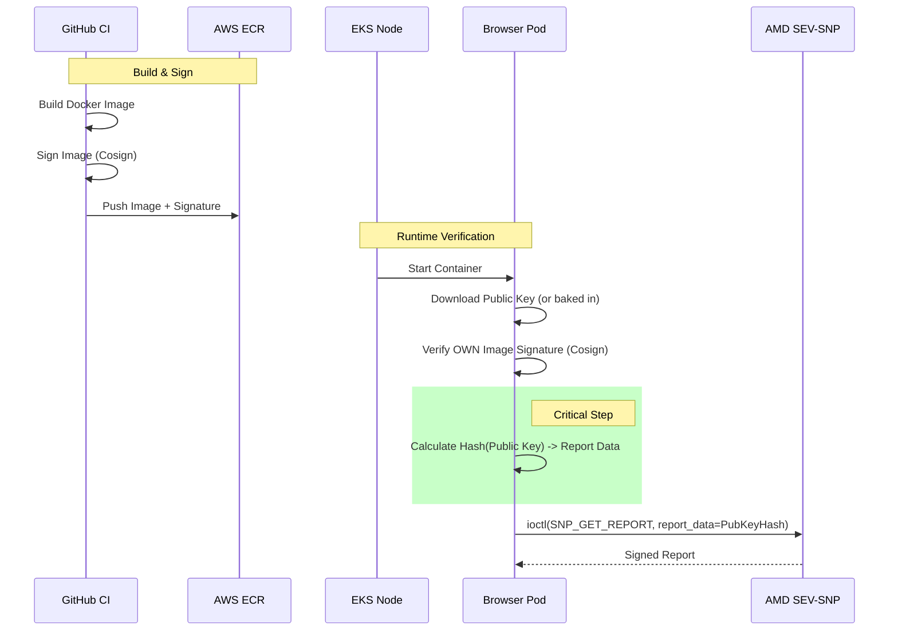

# Attestation Strategy: Standard Containers + Cosign + Node Hardening

> [!IMPORTANT]
> This strategy provides **strong binding** between the code and the attestation report but does **not** provide the hardware-level isolation of Confidential Containers. It is a "Defense-in-Depth" approach.

## Overview

The goal is to prevent the SEV-SNP hardware from signing a report for a malicious or unauthorized container image. We achieve this by requiring the container to prove its own identity (via cryptographic signature verification) *before* requesting an attestation report.

### Trust Model
1.  **Trust the Hardware (AMD SEV-SNP)**: To correctly sign reports.
2.  **Trust the Node (AWS EKS Node)**: To isolate containers (using `cgroups`/`namespaces`) and not be compromised by a root-level attacker.
3.  **Trust the Builder (CI/CD)**: To only sign valid images.

## Architecture



## Implementation Steps

### 1. Supply Chain Check (CI/CD)
Ensure all images are signed using `cosign` in the build pipeline.

```yaml
# .github/workflows/ci.yaml
- name: Sign image with a key
  run: |
    cosign sign --key cosign.key ${IMAGE_URI}
```

### 2. Runtime Verification (In-Container)
Update the `attest.js` script to perform self-verification.

**Logic:**
1.  Read `IMAGE_DIGEST` from environment.
2.  Use `cosign verify` to check that `IMAGE_DIGEST` is signed by the **Trusted Public Key** (bundled in the container).
3.  **If Verification Fails**: Abort. Do not request an attestation report.
4.  **If Verification Succeeds**:
    *   Calculate `Hash(ImageDigest + Trusted Public Key)`.
    *   Use this hash as the `REPORT_DATA` for the SEV-SNP request.
    *   **Note**: To handle potential alignment issues in the report structure, the 32-byte hash is duplicated to fill the entire 64-byte `REPORT_DATA` field.

### 3. Node Hardening (Infrastructure)
Since we rely on the Node to enforce isolation, we must harden it:
*   **Limit Privileged Access**: Avoid `privileged: true` if possible (though SEV-SNP access usually requires it or specific device cgroups).
*   **Seccomp/AppArmor**: Use profiles to restrict container syscalls.
*   **Separate Node Groups**: Run SNP workloads on dedicated, tainted node groups to prevent unrelated (potentially malicious) pods from landing on the same hardware.

## Verification (The Client)
The client (Verifier) now checks:

1.  **SNP Signature**: Validates the report is from genuine AMD hardware.
2.  **Report Data**: Confirms `REPORT_DATA` contains `Hash(ImageDigest + Expected Public Key)`.
    *   The verifier should check if the hash is present in the first 32 bytes OR the second 32 bytes of the report data field.
3.  **Implication**: "The hardware witnessed a process that possessed the Trusted Public Key, was running the exact software specified by the Image Digest, and successfully verified its own image signature."

## Limitations
*   **Root Compromise**: If an attacker gains root access to the **Node**, they can bypass the in-container check and manually request a report using the correct `REPORT_DATA`.
*   **Malicious Image with Key**: If an attacker steals the private signing key, they can sign a malicious image that passes verification.
