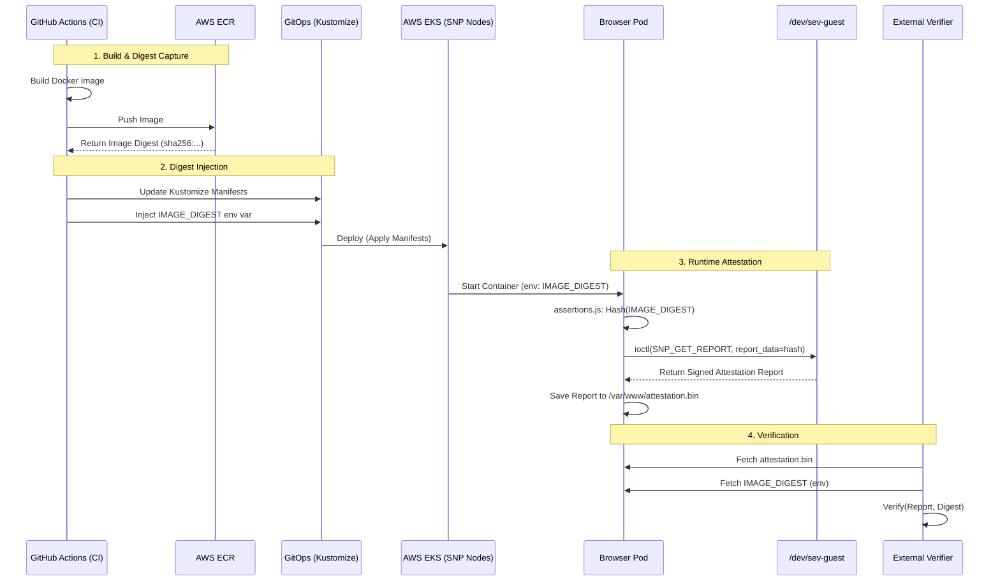

# SEV-SNP Attestation Flow

This document outlines the end-to-end flow for **SEV-SNP (Secure Encrypted Virtualization - Secure Nested Paging)** attestation in the `browser-node` service.

The goal is to provide a **cryptographic proof** that the code running inside the TEE (Trusted Execution Environment) exactly matches the container image built by our CI/CD pipeline.

## High-Level Architecture

---

## Detailed Components

### 1. Build Time (CI/CD)
**File**: `.github/workflows/ci.yaml`

*   **Action**: When the `browser-node` image is built, we immediately capture its **immutable SHA256 digest**.
*   **Pinning**: We update the `kustomization.yaml` to pin the deployment to this specific digest (e.g., `...browser-node@sha256:abc...`).
*   **Injection**: We inject this same digest string into the deployment as an environment variable (`IMAGE_DIGEST`).
    *   *Why?* The application inside the container doesn't know its own image hash. We must provide it so it can include it in the attestation report.

### 2. Runtime (The Browser Node)
**Files**: `services/browser-node/attest.js`, `services/browser-node/snp_ioctl.c`

*   **Startup**: The `entrypoint.sh` executes `node /attest.js` *before* the main application starts.
*   **Device Check**: The script checks if `/dev/sev-guest` exists.
    *   If missing (and not in mock mode), it logs a warning and skips attestation (allows running on non-SNP nodes).
*   **Binding**:
    1.  Reads `IMAGE_DIGEST` from environment.
    2.  Hashes it (SHA256) to fit into the **64-byte `report_data`** field of the SEV-SNP report.
    3.  Calls the C helper (`snp_ioctl`) with this hash.
*   **Kernel Interaction**: `snp_ioctl` opens `/dev/sev-guest` and issues the `SNP_GET_REPORT` ioctl. The AMD Secure Processor signs the report, including our custom data (the image digest hash) and platform metrics (measurement).
*   **Output**: The signed binary report is saved to `/var/www/attestation.bin`.

### 3. Verification
**Files**: `services/browser-node/verify_local.js`

A verifier (user or client) can validate the integrity of the running workload:

1.  **Fetch Report**: Download `attestation.bin` from the pod.
2.  **Fetch Claim**: Get the claimed `IMAGE_DIGEST` from the pod's environment.
3.  **Cryptographic Check**:
    *   Extract the `report_data` field from the binary report.
    *   Calculate `SHA256(Claimed_Digest)`.
    *   **Assert**: `report_data` **contains** the calculated hash.

If they match, it proves that the hardware (AMD SEV-SNP) viewed the specific `IMAGE_DIGEST` at the time the report was generated. Since the image digest is immutable and pinned by CI, this links the hardware proof to the source code.
