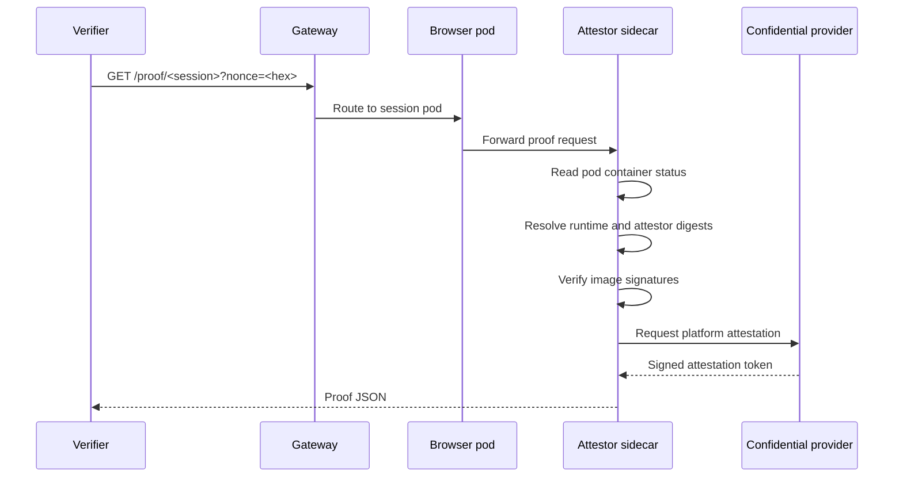

# Attestation

Popcorn OSS v1 treats attestation as optional. The local Kind demo disables attestation by default because Kind does not provide confidential-computing hardware claims.

Production operators can enable the `browser-runtime-attestor` sidecar on compatible infrastructure to provide a proof that a live browser session is backed by expected signed image digests.

## What The Proof Binds

The attestor is designed to bind:

- a caller-provided nonce;
- the running `browser-runtime` container name and image digest;
- the running `browser-runtime-attestor` container name and image digest;
- an attestation token from the underlying confidential-computing provider.

The proof is useful when a verifier needs confidence that a session is running the expected browser workload on a supported trusted execution environment.

## High-Level Flow


```mermaid
sequenceDiagram
    participant Client as Verifier
    participant Gateway as Gateway
    participant Browser as Browser pod
    participant Attestor as Attestor sidecar
    participant Provider as Confidential provider

    Client->>Gateway: GET /proof/<session>?nonce=<hex>
    Gateway->>Browser: Route to session pod
    Browser->>Attestor: Forward proof request
    Attestor->>Attestor: Read pod container status
    Attestor->>Attestor: Resolve runtime and attestor digests
    Attestor->>Attestor: Verify image signatures
    Attestor->>Provider: Request platform attestation
    Provider-->>Attestor: Signed attestation token
    Attestor-->>Client: Proof JSON
```

## Proof Endpoint

Through the gateway:

```http
GET /proof/<sessionId>?nonce=<hex-nonce>
```

Example:

```bash
curl -sS "https://gateway.example.com/proof/demo-session?nonce=<hex-nonce>"
```

The nonce must be generated by the verifier and should be unique per proof request.

## Proof Shape

```json
{
  "proof_version": "v3",
  "tee_provider": "<provider>",
  "tee_technology": "<technology>",
  "nonce": "<hex nonce>",
  "timestamp": "2026-05-11T00:00:00Z",
  "workload": {
    "container_name": "browser-runtime",
    "image_digest": "ghcr.io/reclaimprotocol/popcorn-oss/browser-runtime@sha256:<digest>"
  },
  "verifier": {
    "container_name": "browser-runtime-attestor",
    "image_digest": "ghcr.io/reclaimprotocol/popcorn-oss/browser-runtime-attestor@sha256:<digest>"
  },
  "attestation": {
    "token": "<provider attestation token>"
  }
}
```

## Verification

Use the verifier script:

```bash
node scripts/attestation/verify_gcp_proof.js \
  --session <SESSION_ID> \
  --nonce <HEX_NONCE> \
  --gateway-url <GATEWAY_URL>
```

Or verify a saved proof:

```bash
node scripts/attestation/verify_gcp_proof.js \
  --proof-file ./proof.json \
  --nonce <HEX_NONCE> \
  --audience <EXPECTED_AUDIENCE>
```

The current verifier is provider-specific. Additional providers may need their own verifier or provider adapters.

Verification should check:

- proof version and provider fields;
- returned nonce;
- expected container names;
- runtime and attestor image digests;
- image signatures;
- attestation token signature and audience;
- provider-specific hardware and secure-boot claims;
- digest-binding data inside the attestation token, when supported.

## Deployment Requirements

Attestation requires:

- compatible confidential-computing nodes;
- attestor sidecar enabled in the browser fleet chart;
- digest-pinned runtime and attestor images;
- public verification key for image signatures;
- provider APIs available to the attestor;
- a verifier that understands the provider token.

Local Kind deployments should keep:

```yaml
browserRuntimeAttestor:
  enabled: false
```

## Limitations

- Attestation is not part of the minimal local demo.
- A proof says something about the running workload and platform at proof time; it is not a replacement for session authentication, network security, or application-level authorization.
- Operators are responsible for choosing trusted images, signing them, pinning digests, and publishing verifier instructions for their deployment.
