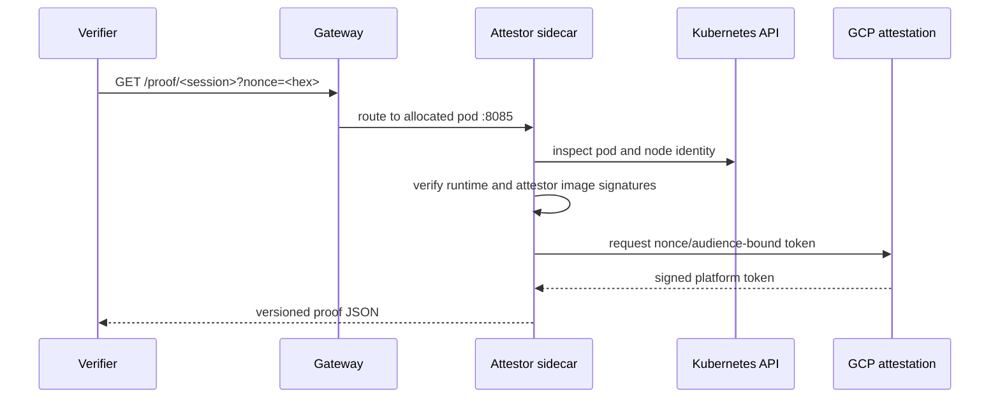

# Attestation

Attestation is an optional GKE feature for deployments that need a
nonce-bound statement about the browser and attestor images running on
confidential-computing nodes. It is disabled by default and unavailable in the
Kind quickstart.

## What it proves

The attestor sidecar combines:

- a verifier-provided nonce;
- the running `browser-runtime` image digest;
- the running `browser-runtime-attestor` image digest;
- image-signature verification using the public key baked into the attestor
  image;
- a GCP confidential-computing attestation token;
- proof timestamp and platform metadata.

A valid proof is evidence about one workload at proof time. It does not replace
client authentication, path authorization, browser isolation, or application
security.

## Flow


```mermaid
sequenceDiagram
    participant V as Verifier
    participant G as Gateway
    participant A as Attestor sidecar
    participant K as Kubernetes API
    participant P as GCP attestation

    V->>G: GET /proof/<session>?nonce=<hex>
    G->>A: route to allocated pod :8085
    A->>K: inspect pod and node identity
    A->>A: verify runtime and attestor image signatures
    A->>P: request nonce/audience-bound token
    P-->>A: signed platform token
    A-->>V: versioned proof JSON
```

The sidecar also exposes `/health` inside the pod.

## Requirements

- GKE Standard browser nodes with a supported confidential-computing type;
- GCP Confidential Computing API and workload identity permissions;
- browser pods scheduled exclusively onto the intended confidential node pool;
- confidential-computing device plugin available as `google.com/cc`;
- TPM event log mounted from the node;
- digest-pinned and signed browser and attestor images;
- an attestor image built with the trusted `/etc/cosign.pub`;
- a verifier that validates the GCP token and the Popcorn proof fields.

Use Google's current Confidential GKE and IAM documentation to create the node
pool and workload identity. Hardware types and regional availability are cloud
provider constraints, not Popcorn chart guarantees.

## Browser values

```yaml
region: us-central1
gatewayDomain: browser.example.com

serviceAccount:
  gcpServiceAccount: browser-attestor@example-project.iam.gserviceaccount.com

ccDevicePlugin:
  enabled: true

browserRuntimeImage: ghcr.io/reclaimprotocol/popcorn-oss/browser-runtime@sha256:<runtime-digest>
browserRuntimeAttestorImage: ghcr.io/reclaimprotocol/popcorn-oss/browser-runtime-attestor@sha256:<attestor-digest>

browserRuntimeAttestor:
  enabled: true
  imagePullPolicy: IfNotPresent

fleet:
  nodeSelector:
    cloud.google.com/gke-nodepool: browser-confidential
  browserRuntimeAttestorCpuRequest: "100m"
  browserRuntimeAttestorCpuLimit: "200m"
  browserRuntimeAttestorMemoryRequest: 128Mi
  browserRuntimeAttestorMemoryLimit: 256Mi
```

Add the node pool's taint toleration when one is used. The attestor container
requests `google.com/cc: "1"`; a pod that cannot obtain it remains Pending,
which is safer than silently running without evidence.

## Verify the deployment

```bash
kubectl -n kube-system get daemonset cc-device-plugin
kubectl -n popcorn get gameservers -o wide
kubectl -n popcorn describe pod <browser-pod>
kubectl -n popcorn logs <browser-pod> \
  -c browser-runtime-attestor --tail=100
```

Confirm the browser pod is on the intended confidential node and that both
images are the expected digests.

Request a proof with a new nonce:

```bash
NONCE=$(openssl rand -hex 32)
curl -fsS \
  "https://browser.example.com/proof/<session-id>?nonce=$NONCE" | jq
```

The response is expected to contain a proof version, the supplied nonce,
workload and verifier image identities, and a GCP attestation token.

## Verifier requirements

Do not accept the JSON merely because the endpoint returned 200. The verifier
must check:

- exact nonce equality and freshness;
- supported proof version and provider;
- expected runtime and attestor container names and digests;
- image signatures against the trusted key/identity;
- GCP token signature, audience, time bounds, and hardware claims;
- binding between platform evidence and the expected workload where the token
  format supports it.

Popcorn OSS does not ship a complete policy verifier. Operators must publish
the accepted image digests, signer identity, platform claims, and proof version
for their deployment.

## Rollout and incident rules

- Treat any new image digest as a policy change.
- Roll attestor and runtime images together only when the verifier allow list
  is prepared for both.
- Disable public proof routing if evidence cannot be verified.
- Do not fall back to a non-confidential node pool.
- Preserve proof and verification decisions without logging session bearer
  URLs or unrelated Secret material.

## Disable cleanly

```yaml
browserRuntimeAttestor:
  enabled: false
ccDevicePlugin:
  enabled: false
```

After rollout, verify new browser pods contain no attestor container and no
`google.com/cc` request. Remove the device plugin only when no other workload
uses it.
