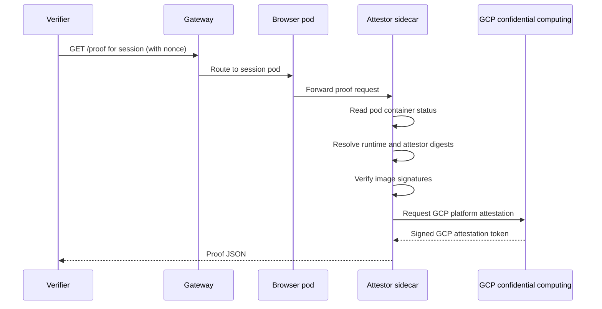

# Attestation

Popcorn OSS v1 treats attestation as optional. The local Kind demo disables attestation by default because Kind does not provide confidential-computing hardware claims.

Production operators can enable the `browser-runtime-attestor` sidecar on compatible GCP confidential-computing infrastructure to provide a proof that a live browser session is backed by expected signed image digests.

## What The Proof Binds

The attestor is designed to bind:

- a caller-provided nonce;
- the running `browser-runtime` container name and image digest;
- the running `browser-runtime-attestor` container name and image digest;
- an attestation token from GCP confidential computing.

The proof is useful when a verifier needs confidence that a session is running the expected browser workload on a supported trusted execution environment.

## High-Level Flow


```mermaid
sequenceDiagram
    participant Client as Verifier
    participant Gateway as Gateway
    participant Browser as Browser pod
    participant Attestor as Attestor sidecar
    participant Provider as GCP confidential computing

    Client->>Gateway: GET /proof for session (with nonce)
    Gateway->>Browser: Route to session pod
    Browser->>Attestor: Forward proof request
    Attestor->>Attestor: Read pod container status
    Attestor->>Attestor: Resolve runtime and attestor digests
    Attestor->>Attestor: Verify image signatures
    Attestor->>Provider: Request GCP platform attestation
    Provider-->>Attestor: Signed GCP attestation token
    Attestor-->>Client: Proof JSON
```

## Proof Endpoint

Through the gateway:

```http
GET /proof/<sessionId>?nonce=<hex-nonce>
```

Example:

```bash
curl -sS "https://gateway.example.com/proof/demo-session?nonce=<hex-nonce>"
```

The nonce must be generated by the verifier and should be unique per proof request.

## Proof Shape

```json
{
  "proof_version": "v3",
  "tee_provider": "gcp",
  "tee_technology": "amd-sev",
  "nonce": "<hex nonce>",
  "timestamp": "2026-05-11T00:00:00Z",
  "workload": {
    "container_name": "browser-runtime",
    "image_digest": "ghcr.io/reclaimprotocol/popcorn-oss/browser-runtime@sha256:<digest>"
  },
  "verifier": {
    "container_name": "browser-runtime-attestor",
    "image_digest": "ghcr.io/reclaimprotocol/popcorn-oss/browser-runtime-attestor@sha256:<digest>"
  },
  "attestation": {
    "token": "<gcp attestation token>"
  }
}
```

## Verification

Popcorn OSS does not currently ship a standalone verifier script. Treat the
endpoint as a proof source and verify the returned JSON in your own verifier.
The current proof format is GCP-specific.

Verification should check:

- proof version and GCP provider fields;
- returned nonce;
- expected container names;
- runtime and attestor image digests;
- image signatures;
- attestation token signature and audience;
- GCP hardware and secure-boot claims;
- digest-binding data inside the attestation token, when supported.

## Deployment Requirements

Attestation requires:

- compatible GCP confidential-computing nodes;
- attestor sidecar enabled in the browser fleet chart;
- digest-pinned runtime and attestor images;
- public verification key for image signatures;
- GCP APIs available to the attestor;
- a verifier that understands the GCP attestation token.

## Setup

Attestation is a GKE production add-on. Do not enable it in the local Kind path.

### 1. Create Confidential Browser Nodes

Create a GKE Standard node pool for browser GameServers with
[Confidential GKE Nodes](https://cloud.google.com/kubernetes-engine/docs/how-to/confidential-gke-nodes)
enabled. Use a confidential node type and machine family supported in your
region. AMD `n2d` nodes with `sev` are the baseline shape used in these docs:

```bash
gcloud container node-pools create browser-confidential \
  --cluster "$GKE_CLUSTER" \
  --location "$GKE_LOCATION" \
  --machine-type n2d-standard-8 \
  --disk-type pd-balanced \
  --disk-size 200 \
  --enable-autoscaling \
  --min-nodes 1 \
  --max-nodes 10 \
  --confidential-node-type sev
```

Verify the node pool:

```bash
gcloud container node-pools describe browser-confidential \
  --cluster "$GKE_CLUSTER" \
  --location "$GKE_LOCATION" \
  --format='yaml(confidentialNodes.confidentialInstanceType)'
```

The browser GameServers must actually schedule onto confidential nodes. The
current browser-fleet chart does not expose a dedicated Fleet `nodeSelector`, so
use one of these deployment shapes:

- run the browser workload cluster or browser capacity pool entirely on
  Confidential GKE Nodes;
- keep non-confidential nodes unavailable to browser GameServers through your
  cluster/node-pool operations;
- add scheduling controls downstream before relying on attestation in a mixed
  node cluster.

### 2. Enable The GCP API And IAM

Enable the Confidential Computing API:

```bash
gcloud services enable confidentialcomputing.googleapis.com \
  --project "$GCP_PROJECT_ID"
```

Create or choose the Google service account used by browser pods:

```bash
gcloud iam service-accounts create browser-attestor \
  --project "$GCP_PROJECT_ID"

export BROWSER_ATTESTOR_GSA="browser-attestor@$GCP_PROJECT_ID.iam.gserviceaccount.com"
```

Grant the service account permission to request confidential-computing
attestation tokens. Google documents this permission in
`roles/confidentialcomputing.workloadUser`:

```bash
gcloud projects add-iam-policy-binding "$GCP_PROJECT_ID" \
  --member "serviceAccount:$BROWSER_ATTESTOR_GSA" \
  --role roles/confidentialcomputing.workloadUser
```

Bind the Kubernetes `browser-sa` service account to that Google service account
with Workload Identity:

```bash
gcloud iam service-accounts add-iam-policy-binding "$BROWSER_ATTESTOR_GSA" \
  --project "$GCP_PROJECT_ID" \
  --role roles/iam.workloadIdentityUser \
  --member "serviceAccount:$GCP_PROJECT_ID.svc.id.goog[popcorn/browser-sa]"
```

### 3. Enable Attestation In Browser Fleet Values

Pin both runtime images by digest. The attestor verifies the running
`browser-runtime` and `browser-runtime-attestor` image signatures before it asks
GCP for a platform attestation token.

```yaml
gatewayDomain: gateway.example.com
region: us-central1

serviceAccount:
  gcpServiceAccount: browser-attestor@example-project.iam.gserviceaccount.com

ccDevicePlugin:
  enabled: true

browserRuntimeImage: ghcr.io/reclaimprotocol/popcorn-oss/browser-runtime@sha256:<runtime-digest>
browserRuntimeImagePullPolicy: IfNotPresent

browserRuntimeAttestor:
  enabled: true
  imagePullPolicy: IfNotPresent

browserRuntimeAttestorImage: ghcr.io/reclaimprotocol/popcorn-oss/browser-runtime-attestor@sha256:<attestor-digest>

fleet:
  browserRuntimeAttestorCpuRequest: "100m"
  browserRuntimeAttestorCpuLimit: "200m"
  browserRuntimeAttestorMemoryRequest: 128Mi
  browserRuntimeAttestorMemoryLimit: 256Mi
```

`ccDevicePlugin.enabled=true` installs the GCP confidential-computing device
plugin into `kube-system`. The attestor sidecar requests `google.com/cc: "1"`
and mounts the TPM event log from the node.

### 4. Verify The Runtime Path

After upgrading the browser-fleet release, check the device plugin and a new
browser GameServer:

```bash
kubectl -n kube-system get daemonset cc-device-plugin
kubectl -n popcorn get gameservers -o wide
kubectl -n popcorn describe pod <browser-pod-name> | grep -A8 browser-runtime-attestor
kubectl -n popcorn logs <browser-pod-name> -c browser-runtime-attestor --tail=100
```

Then request a proof with a fresh nonce:

```bash
NONCE=$(openssl rand -hex 32)
curl -sS "https://gateway.example.com/proof/<sessionId>?nonce=$NONCE"
```

The response should include `proof_version`, `workload`, `verifier`, and an
`attestation.token`.

Local Kind deployments should keep:

```yaml
ccDevicePlugin:
  enabled: false

browserRuntimeAttestor:
  enabled: false
```

## Limitations

- Attestation is not part of the minimal local demo.
- A proof says something about the running workload and platform at proof time; it is not a replacement for session authentication, network security, or application-level authorization.
- Operators are responsible for choosing trusted images, signing them, pinning digests, and publishing verifier instructions for their deployment.
