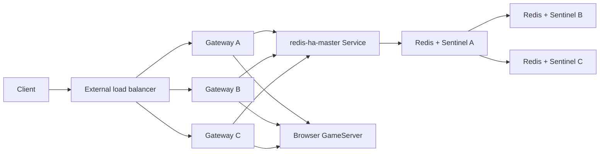

# High Availability

<!-- markdownlint-disable MD013 -->

This guide describes the supported high-availability shape for the Popcorn
gateway and Redis routing store. It also provides a no-downtime migration
procedure from the legacy single Redis deployment.

The recommendations here protect the live session-routing path. They do not
make browser GameServers durable: browser pods remain intentionally ephemeral.

## Availability Model

Every request to a live browser passes through the gateway. On a cache miss,
the gateway asks Redis which browser pod owns the session and then proxies the
request to that pod.



The production target is:

- three gateway replicas on different nodes and zones;
- a PodDisruptionBudget that keeps at least two gateways available;
- zero-unavailable gateway rolling updates;
- load-balancer-aware gateway shutdown;
- three Redis/Sentinel pods on different nodes and zones;
- persistent storage for every Redis pod;
- Sentinel quorum of two;
- a master-only Service used by gateway and pool manager;
- AOF persistence and a minimum healthy-replica write policy.

This design tolerates one gateway pod failure and one Redis pod failure. A
single-zone failure is also tolerated when the cluster has schedulable capacity
in the remaining zones.

## Redis HA

The platform chart uses the Bitnami Redis chart in replication mode with
Sentinel enabled. Each StatefulSet pod runs Redis and Sentinel. Sentinel elects
a replacement master after the current master is considered down, and the
`redis-ha-master` Service follows the elected master.

Applications should use the Service, not individual StatefulSet pod names:

```yaml
poolManager:
  redisHost: redis-ha-master

gateway:
  redisHost: redis-ha-master.popcorn.svc.cluster.local
```

Use a fully qualified Service name for OpenResty. Lua DNS resolution can differ
from application-library resolution, and the FQDN removes namespace search-path
ambiguity.

### Recommended Redis values

```yaml
redis:
  enabled: false

redisHa:
  enabled: true
  fullnameOverride: redis-ha
  architecture: replication
  auth:
    enabled: false
  commonConfiguration: |-
    appendonly yes
    appendfsync everysec
    min-replicas-to-write 1
    min-replicas-max-lag 10
  replica:
    replicaCount: 3
    podAntiAffinityPreset: hard
    topologySpreadConstraints:
      - maxSkew: 1
        topologyKey: topology.kubernetes.io/zone
        whenUnsatisfiable: ScheduleAnyway
        labelSelector:
          matchLabels:
            app.kubernetes.io/name: redisHa
            app.kubernetes.io/component: node
    persistence:
      enabled: true
      storageClass: standard-rwo
      size: 8Gi
    pdb:
      create: true
      maxUnavailable: 1
  sentinel:
    enabled: true
    masterSet: reclaim-master
    quorum: 2
    downAfterMilliseconds: 5000
    failoverTimeout: 30000
    parallelSyncs: 1
    masterService:
      enabled: true
```

Production deployments should also pin Redis, Sentinel, and helper images by
digest.

### Consistency and recovery expectations

Redis replication is asynchronous. `appendfsync everysec` and
`min-replicas-to-write 1` reduce the loss window, but they do not provide a
zero-recovery-point guarantee. Under normal conditions, a promoted replica is
usually close to the former master; a failure at the wrong instant can still
lose the newest acknowledged writes.

During promotion, clients can briefly receive a connection reset,
`READONLY`, or `MASTERDOWN`. Pool manager reconnects and discovers the new
master through the master Service. Gateway requests that miss their two-second
worker cache need Redis to be reachable; if no Redis master is available, the
gateway returns HTTP 500.

## Gateway HA

Gateway replicas are stateless. JWT verification keys are mounted from the same
Secret, and route state lives in Redis, so any ready replica can handle any
request.

### Recommended gateway values

```yaml
gateway:
  enabled: true
  replicas: 3
  updateStrategy:
    maxSurge: 1
    maxUnavailable: 0
  podDisruptionBudget:
    enabled: true
    minAvailable: 2
  topologySpreadConstraints:
    - maxSkew: 1
      topologyKey: topology.kubernetes.io/zone
      whenUnsatisfiable: DoNotSchedule
      matchLabelKeys:
        - pod-template-hash
      labelSelector:
        matchLabels:
          app: gateway
    - maxSkew: 1
      topologyKey: kubernetes.io/hostname
      whenUnsatisfiable: DoNotSchedule
      matchLabelKeys:
        - pod-template-hash
      labelSelector:
        matchLabels:
          app: gateway
  terminationGracePeriodSeconds: 75
  gracefulShutdown:
    enabled: true
    delaySeconds: 60
  backendConfig:
    enabled: true
    connectionDrainingTimeoutSec: 60
```

`matchLabelKeys: [pod-template-hash]` is important during rolling updates. It
balances each ReplicaSet independently; without it, old pods can influence
placement and leave the final ReplicaSet unevenly distributed after they exit.

### Shutdown order

When Kubernetes terminates a gateway pod, the lifecycle hook:

1. keeps OpenResty serving while the pod is removed from Service and load
   balancer endpoints;
2. waits for the configured detach delay;
3. sends OpenResty a graceful quit signal;
4. allows a final drain window before Kubernetes enforces the termination
   deadline.

Do not signal OpenResty before the endpoint is detached. An external load
balancer may continue selecting the endpoint briefly, which produces timeouts
if OpenResty has already stopped accepting connections.

The gateway pod template includes a checksum of its Redis and extra-route
configuration. A configuration change therefore creates a new ReplicaSet and
reloads OpenResty instead of relying on an in-place ConfigMap update.

## Migrating From Single Redis

Do not switch an active installation directly from an old Redis Service to an
empty HA cluster. Use dual writes and explicit parity checks.

### 1. Deploy HA Redis beside the singleton

Keep the old Redis authoritative:

```yaml
redis:
  enabled: true

redisHa:
  enabled: true

poolManager:
  redisHost: redis
  redisSecondaryHost: redis-ha-master

gateway:
  redisHost: redis.popcorn.svc.cluster.local
```

Wait for all three HA pods, all persistent volumes, Sentinel quorum, and the
master Service endpoint.

### 2. Bootstrap and compare data

The pool-manager package includes a binary-safe `DUMP`/`RESTORE` migration
tool. It copies every Redis type, preserves TTLs, removes target-only keys, and
then compares keys, values, and TTLs.

From a host that can reach both Redis Services:

```bash
cd services/pool-manager

REDIS_SOURCE_HOST=redis.popcorn.svc.cluster.local \
REDIS_TARGET_HOST=redis-ha-master.popcorn.svc.cluster.local \
bun run redis:sync

REDIS_SOURCE_HOST=redis.popcorn.svc.cluster.local \
REDIS_TARGET_HOST=redis-ha-master.popcorn.svc.cluster.local \
bun run redis:compare
```

The default TTL tolerance is five seconds. Override it only when the reason for
the difference is understood:

```bash
REDIS_TTL_TOLERANCE_MS=10000 \
REDIS_SOURCE_HOST=<source> \
REDIS_TARGET_HOST=<target> \
bun run redis:compare
```

Run comparison more than once while live sessions are being created and
deleted. Key counts can legitimately change between samples; each individual
comparison must pass.

### 3. Cut over with a reverse mirror

After sustained parity, make HA Redis authoritative and temporarily mirror
writes back to the singleton:

```yaml
poolManager:
  redisHost: redis-ha-master
  redisSecondaryHost: redis

gateway:
  redisHost: redis-ha-master.popcorn.svc.cluster.local
```

Verify new session allocation, browser routing, CDP, runtime API, and proof
routes. Repeat the parity check with HA Redis as the source.

The primary Redis is always authoritative. Secondary mirror failures are
logged but do not fail session allocation.

### 4. Test failover

Promote a replica only during a controlled maintenance window. Continuously
probe a real gateway route while the master changes, then verify:

- the master Service endpoint moved;
- Sentinel reports quorum;
- the new master has two connected replicas after recovery;
- pool-manager and gateway logs have no continuing Redis errors;
- new sessions can still be allocated and deleted.

### 5. Remove the singleton

Only after the reverse-mirror parity check and failover test pass:

```yaml
redis:
  enabled: false

poolManager:
  redisHost: redis-ha-master
  redisSecondaryHost: ""

gateway:
  redisHost: redis-ha-master.popcorn.svc.cluster.local
```

Confirm the old Deployment and Service are gone after the GitOps controller
prunes them.

## Day-2 Validation

Set the namespace once for the following examples:

```bash
POPCORN_NAMESPACE=popcorn
```

### Redis

```bash
kubectl -n "$POPCORN_NAMESPACE" get statefulset redis-ha-node
kubectl -n "$POPCORN_NAMESPACE" get pods -l app.kubernetes.io/name=redisHa -o wide
kubectl -n "$POPCORN_NAMESPACE" get pvc
kubectl -n "$POPCORN_NAMESPACE" get pdb redis-ha-node
kubectl -n "$POPCORN_NAMESPACE" get endpoints redis-ha-master

kubectl -n "$POPCORN_NAMESPACE" exec redis-ha-node-0 -c redis -- \
  redis-cli INFO replication

kubectl -n "$POPCORN_NAMESPACE" exec redis-ha-node-0 -c sentinel -- \
  redis-cli -p 26379 SENTINEL CKQUORUM reclaim-master
```

Healthy Redis should show one master, two replicas with
`master_link_status:up`, two connected replicas on the master, and at least two
usable Sentinels.

### Gateway

```bash
kubectl -n "$POPCORN_NAMESPACE" get deployment popcorn-gateway
kubectl -n "$POPCORN_NAMESPACE" get pods -l app=gateway \
  -L topology.kubernetes.io/zone -o wide
kubectl -n "$POPCORN_NAMESPACE" get pdb popcorn-gateway
kubectl -n "$POPCORN_NAMESPACE" get endpointslice \
  -l kubernetes.io/service-name=popcorn-gateway
```

Healthy gateway state is three ready replicas, three distinct zones and
hostnames, a PDB with one allowed disruption, and three ready/non-terminating
endpoints.

### Logs

```bash
kubectl -n "$POPCORN_NAMESPACE" logs deployment/pool-manager --since=15m |
  grep -Ei 'redis|READONLY|MASTERDOWN'

kubectl -n "$POPCORN_NAMESPACE" logs -l app=gateway --since=15m --prefix |
  grep -Ei 'redis|connection refused|host not found'
```

Investigate repeated connection errors, DNS failures, `READONLY`, or
`MASTERDOWN`. A single reconnect at the exact promotion boundary can occur;
continuing errors after the master Service moves are not expected.

## Failure Matrix

| Failure | Expected behavior |
| --- | --- |
| One gateway pod or node | Load balancer uses the other two gateways; replacement is scheduled. |
| Voluntary second gateway disruption | PDB blocks it until at least two gateways remain healthy. |
| One Redis replica | Master continues serving; StatefulSet restores the replica. |
| Redis master | Sentinel promotes a replica and the master Service moves. Brief client reconnects are possible. |
| One zone | One gateway and one Redis pod can be lost while remaining replicas serve traffic. |
| Redis quorum lost | Automatic promotion is unsafe or unavailable; route-cache misses can return HTTP 500. |
| All gateways unavailable | Public browser, CDP, API, and proof routes are unavailable even if proof computation completed elsewhere. |

## Rollback

Before deleting the singleton, rollback is:

1. point gateway back to the singleton FQDN;
2. make the singleton the pool-manager primary;
3. keep HA Redis as the secondary mirror;
4. verify routing and parity before investigating the HA cluster.

After deleting the singleton, do not point applications at a newly created,
empty Redis instance. Recover or repair the HA cluster from its persistent
volumes, or perform an explicit restore from a known-good backup.

## Acceptance Checklist

- [ ] Three gateway replicas are ready on distinct nodes and zones.
- [ ] Gateway PDB requires two available replicas.
- [ ] A controlled gateway eviction produces no failed public probes.
- [ ] Three Redis/Sentinel pods are ready on distinct nodes and zones.
- [ ] Redis master reports two connected replicas.
- [ ] Sentinel quorum check succeeds.
- [ ] The master Service targets the elected master.
- [ ] New session create, route, extend, and delete operations succeed.
- [ ] Browser, CDP, runtime API, and proof routes succeed.
- [ ] Gateway and pool-manager logs contain no continuing Redis errors.
