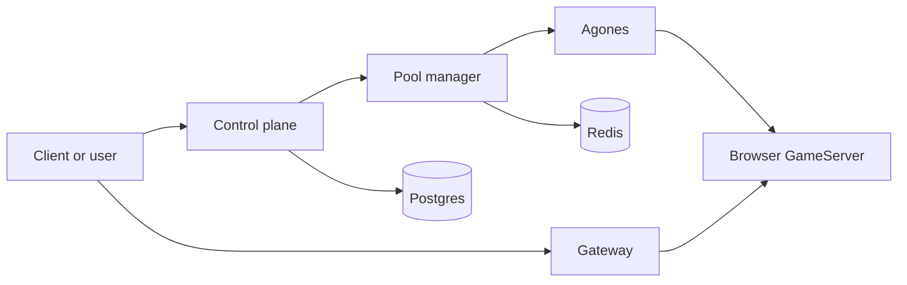

# Popcorn Docs

Popcorn is a self-hostable browser runtime platform for Kubernetes. It starts
ephemeral Chromium sessions, routes browser/CDP/API traffic through a gateway,
and lets clients create sessions through the control plane.

These docs are organized for operators who want to run Popcorn themselves.

## Read This First

1. [Quickstart](quickstart.md): run Popcorn locally with Kind.
2. [Deployment](deployment.md): deploy the supported production shape on GKE.
3. [GKE IP-only deployment](gke-ip-only-deployment.md): smoke-test GKE
   self-hosting before DNS and managed certificates are ready.
4. [Configuration](configuration.md): understand required and optional settings.
5. [Secrets](secrets.md): create the Kubernetes Secrets Popcorn expects.
6. [Reference](reference.md): session API, gateway paths, and config index.

## Operate It

- [Operations](operations.md): validate, upgrade, scale, and run optional services.
- [Security](security.md): practical self-hosting security model and hardening.
- [Browser networking](networking.md): Cloudflare TURN, static ICE servers, and direct Agones UDP.
- [Observability](observability.md): optional OpenTelemetry log export and ClickHouse session bindings.
- [Troubleshooting](troubleshooting.md): diagnose local, Helm, auth, and browser issues.

## Optional Areas

- [Attestation](attestation.md): GCP confidential-computing proof flow.
- [Images and releases](images-and-releases.md): images, tags, digests, and release inputs.

## Repository Map

| Path | Purpose |
| --- | --- |
| `charts/platform` | Gateway, pool manager, Redis, control plane, transitional bundled Postgres, TTL controller, and optional operations services. |
| `charts/browser-fleet` | Agones browser Fleet, browser runtime, WebRTC/TURN settings, autoscaler, and optional attestor. |
| `services/*` | Source for platform services. |
| `popcorn-images` | Browser image assets and runtime image build inputs. |
| `examples/helm` | Starting values for production-style GKE installs. |
| `examples/kubernetes` | Secret bootstrap examples. |

## What Runs In A Normal Install

The gateway is the only service that normally needs to be public. The control
plane can be public if clients create sessions directly, but protect its admin
surface carefully.
