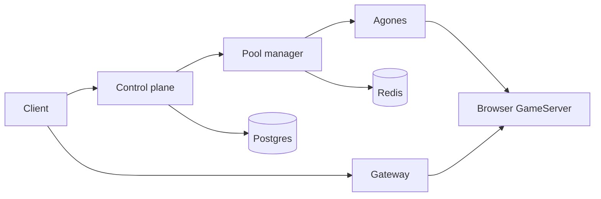

# Popcorn documentation

Popcorn runs disposable Chromium sessions on Kubernetes. Agones manages the
browser workers, a pool manager allocates them, and an authenticated gateway
exposes LiveView and Chrome DevTools Protocol (CDP) without publishing worker
pods directly.

This documentation is written for the people who install and operate Popcorn.
The supported production target is GKE Standard. Kind is provided for local
evaluation and development.

## Choose a path

| Goal | Start here |
| --- | --- |
| See Popcorn working on one machine | [Local quickstart](quickstart.md) |
| Decide whether a cluster can host it | [Requirements and planning](prerequisites.md) |
| Install a production deployment | [Production installation](deployment.md) |
| Understand traffic, state, and trust boundaries | [Architecture](architecture.md) |
| Find a Helm value | [Helm values reference](chart-options.md) |
| Operate an existing deployment | [Operations](operations.md) |
| Diagnose a failure | [Troubleshooting](troubleshooting.md) |

## Hosting guide

Read the hosting pages in this order:

1. [Requirements and planning](prerequisites.md) — supported environment,
   dependencies, capacity inputs, and decisions to make before installation.
2. [Production installation](deployment.md) — install Agones, prepare values and
   Secrets, deploy the two charts, and run an end-to-end acceptance test.
3. [Configuration](configuration.md) — choose exposure, data, capacity,
   authentication, and optional-feature settings.
4. [Networking](networking.md) — DNS, TLS, ingress, WebSockets, internal service
   paths, egress, and NetworkPolicy.
5. [Data and recovery](storage.md) — what lives in Postgres and Redis, what must
   be backed up, and how to recover.
6. [Security](security.md) — production threat boundaries and a hardening
   checklist.

## Day-2 guide

- [Operations](operations.md) — health checks, scaling, maintenance, and
  session cleanup.
- [High availability](high-availability.md) — replicas, failure domains, Redis
  HA, and acceptance tests.
- [Upgrades and uninstall](upgrades.md) — backup, render, rollout, rollback, and
  safe removal.
- [Observability](observability.md) — logs, session correlation, OTLP export,
  and useful signals.
- [Troubleshooting](troubleshooting.md) — evidence-first diagnosis by symptom.
- [Images and releases](images-and-releases.md) — image inventory, pinning, and
  release verification.

## Concepts and reference

- [Architecture](architecture.md) — components, request flow, state, and
  deployment topologies.
- [Browser runtime](popcorn-browser.md) — the worker pod, built-in ports,
  LiveView, CDP, security profiles, and browser policy.
- [API and gateway reference](reference.md) — credentialed session APIs,
  response fields, admin routes, and gateway paths.
- [Secrets reference](secrets.md) — required Secret names, keys, ownership, and
  rotation effects.
- [Helm values reference](chart-options.md) — every value shipped by both
  charts.

## Optional features

- [Attestation](attestation.md) — confidential-computing requirements and proof
  verification.
- [MCP server](mcp-server.md) — remote MCP endpoint with OAuth 2.1 (PKCE) and
  card-funded Popcorn credit.
- [x402 API](x402.md) — isolated paid-session API and its operational model.
- [MPP and x402 client](x402-client.md) — pay for a session and use LiveView or CDP.
- [Session extensions](configuration.md#session-extensions) — add an optional
  same-pod service without changing the OSS browser image.

## What gets installed

The platform chart owns the gateway, pool manager, control plane, optional
Redis, TTL controller, and observability agent. The browser-fleet chart owns the
Agones Fleet, FleetAutoscaler, browser runtime, image pre-puller, and optional
attestor. Agones itself is cluster-level infrastructure and should normally be
installed once, outside either release.
