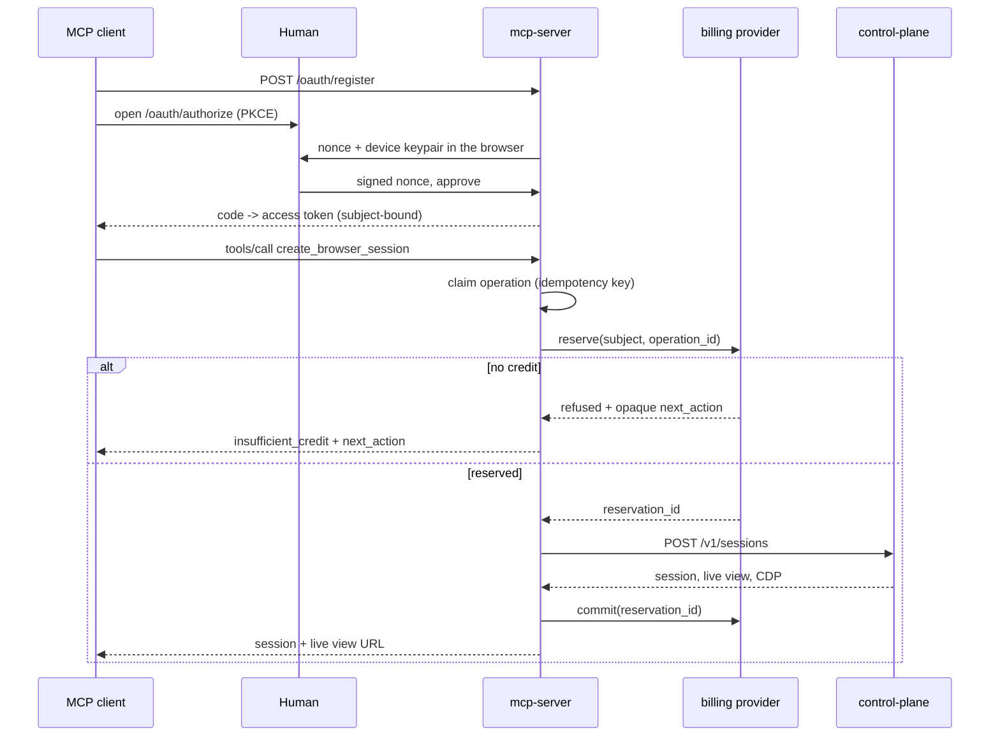

# MCP server

Popcorn's MCP adapter exposes browser sessions to MCP clients and agent
marketplaces over a remote (streamable HTTP) endpoint at `POST /mcp`.

Sign-in is anonymous: the authorization page mints a non-extractable device
keypair in the browser and signs a server nonce — no account, password or
email — wrapped in MCP-native OAuth 2.1 with PKCE.

The service itself sells nothing. Usage credit, if a deployment meters it at
all, is delegated to a `BillingProvider`; this repository contains no payment
provider, pricing, currency or checkout code.

## Flow



## Deploying it

The platform chart ships the service behind `mcpServer.enabled` (off by
default, since it needs Postgres):

```yaml
mcpServer:
  enabled: true
  publicUrl: https://mcp.popcorn.example
  domainName: mcp.popcorn.example
  staticIpName: mcp-popcorn-ip
  secretName: mcp-server-secret   # DATABASE_URL, MCP_TOKEN_SIGNING_KEY,
                                  # POPCORN_CLIENT_ID/SECRET, and
                                  # optional provider tokens
```

The ingress publishes `/mcp`, `/oauth`, `/.well-known` and `/health`.

Human-facing LiveView shortening is optional and disabled by default. To opt
into the built-in popc.click provider, add its API key to `mcp-server-secret`
under `MCP_URL_SHORTENER_API_KEY` and set:

```yaml
mcpServer:
  urlShortener:
    provider: popc
    apiKeyKey: MCP_URL_SHORTENER_API_KEY
    timeoutMs: 5000
```

Self-hosters can bring a compatible service without patching the MCP server:

```yaml
mcpServer:
  urlShortener:
    provider: custom
    endpoint: https://short.example/api/links
    apiKeyKey: "" # or a key in mcp-server-secret when Bearer auth is required
    timeoutMs: 5000
```

The endpoint accepts `POST {"url":"..."}` and returns
`{"code":"...","short_url":"...","url":"..."}`. This applies only to
HTTP(S) LiveView handoff links; CDP WebSocket URLs are never shortened.

## Client configuration

Remote MCP clients need only the URL; the OAuth flow supplies the rest.

```json
{
  "mcpServers": {
    "popcorn": { "url": "https://mcp.popcorn.example/mcp" }
  }
}
```

## Storage

`DATABASE_URL` selects the transactional Postgres store; without it the service
keeps state in memory. Idempotency claims are single conditional statements,
safe across replicas.

## Operation rules

- A tool call claims its `idempotency_key` before reserving or allocating, so
  retries replay one outcome rather than creating a second session; a failed
  allocation releases its reservation.
- Ending a session early does not release the current block.
- One billed operation buys one fixed block of browser time (default 10
  minutes); callers cannot request a longer TTL.

See [`services/mcp-server/README.md`](../services/mcp-server/README.md) for
configuration and operational limits.
