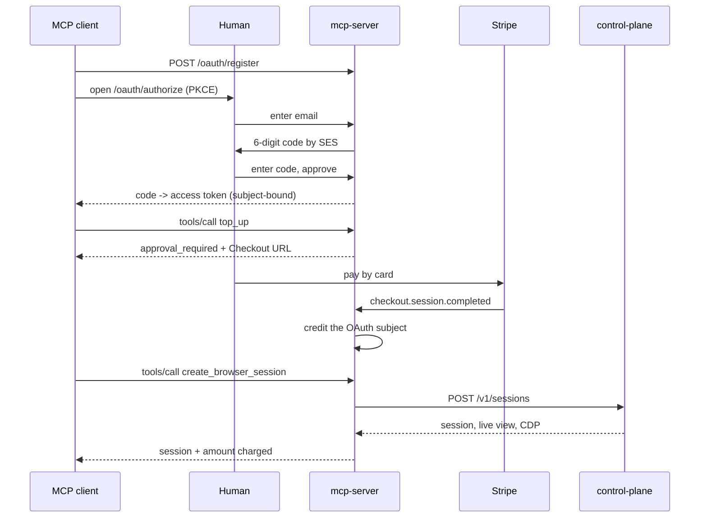

# MCP server

Popcorn's MCP adapter exposes browser sessions to MCP clients and agent
marketplaces over a remote (streamable HTTP) endpoint at `POST /mcp`.

Sign-in is a one-time code emailed by AWS SES — no password and no sign-up
step — wrapped in MCP-native OAuth 2.1 with PKCE, and sessions are paid for
from **Popcorn credit** — a closed-loop prepaid balance topped up by card
through Stripe Checkout. This is an alternative to the x402 path: it needs no
wallet, no private key in client configuration, and no per-call payment
protocol.

## Flow



## Client configuration

Remote MCP clients need only the URL; the OAuth flow supplies the rest.

```json
{
  "mcpServers": {
    "popcorn": { "url": "https://mcp.popcorn.example/mcp" }
  }
}
```

## Money rules

- Credit is denominated in USD cents and is usable only for Popcorn sessions.
- Stripe events credit exactly once; tool calls debit exactly once per
  `idempotency_key`; a failed allocation refunds automatically.
- Ending a session early does not refund the session charge.

See [`services/mcp-server/README.md`](../services/mcp-server/README.md) for
configuration and operational limits.
