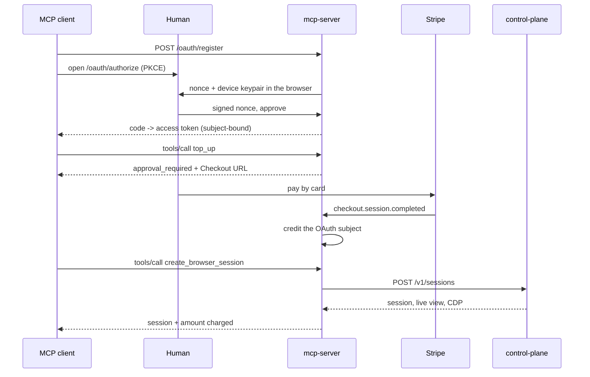

# MCP server

Popcorn's MCP adapter exposes browser sessions to MCP clients and agent
marketplaces over a remote (streamable HTTP) endpoint at `POST /mcp`.

Sign-in is anonymous: the authorization page mints a non-extractable device
keypair in the browser and signs a server nonce — no account, password or
email — wrapped in MCP-native OAuth 2.1 with PKCE, and sessions are paid for
from **Popcorn credit** — a closed-loop prepaid balance topped up by card
through Stripe Checkout. This is an alternative to the x402 path: it needs no
wallet, no private key in client configuration, and no per-call payment
protocol.

## Flow



## Client configuration

Remote MCP clients need only the URL; the OAuth flow supplies the rest.

```json
{
  "mcpServers": {
    "popcorn": { "url": "https://mcp.popcorn.example/mcp" }
  }
}
```

## Storage

`DATABASE_URL` selects the transactional Postgres store; without it the
service keeps state in memory and refuses to start with a live Stripe key.
Ledger writes and idempotency claims are single conditional statements, safe
across replicas.

## Money rules

- Credit is denominated in USD cents and is usable only for Popcorn sessions.
- Stripe events credit exactly once. A tool call claims its `idempotency_key`
  before charging or allocating, so retries replay one outcome rather than
  creating a second session; a failed allocation refunds automatically.
- Ending a session early does not refund the session charge.

See [`services/mcp-server/README.md`](../services/mcp-server/README.md) for
configuration and operational limits.
