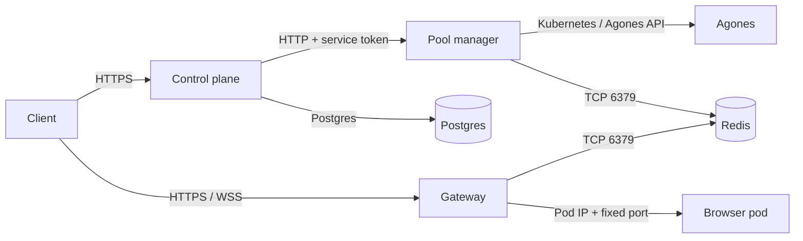

# Networking

Popcorn has one public data plane, one optional public API, and several private
service paths. Most deployment failures are caused by exposing the wrong
service, breaking WebSocket upgrades, or making the gateway unable to reach
browser pod IPs.

## Traffic model



Browser GameServers do not use NodePorts or Agones host ports. The pool manager
stores pod-IP routes in Redis, and the gateway connects directly to the pod IP
and fixed container port.

## Public endpoints

| Endpoint | Protocol | Public by default? | Notes |
| --- | --- | --- | --- |
| Gateway | HTTPS and WSS | Yes | LiveView, CDP, optional extension routes, health |
| Control plane | HTTPS | Optional | Client API and admin UI; protect `/admin` |
| Pool manager | HTTP | No | Internal regional allocation API |
| Redis | TCP 6379 | No | Route and active-session state |
| Postgres | TCP, normally TLS | No | Durable control-plane state |
| Browser pods | fixed pod ports | No | Reached only through the gateway and Agones control path |

## Gateway paths and ports

The browser pod exposes:

| Port name | Container port | Purpose |
| --- | ---: | --- |
| `novnc` | 6080 | LiveView HTML and RFB WebSocket bridge |
| `cdp` | 9222 | restricted client CDP proxy |
| `cdp-internal` | 9226 | trusted full-CDP proxy |

The public gateway listens on port 80 inside the cluster. TLS normally
terminates at GCE Ingress or another operator-managed load balancer. It routes
the authenticated paths listed in [API and gateway reference](reference.md).

## DNS and GKE Ingress

With `gateway.staticIpName` set, the platform chart creates a GCE Ingress bound
to that global static IP. With `gateway.domainName` set, it also creates a
ManagedCertificate and HTTPS redirect. The chart also enables a GKE Network
Endpoint Group (NEG) on the gateway Service so the load balancer can target
Pods directly, including on clusters where GKE does not inject the annotation
automatically. The same behavior applies to the chart-managed control-plane
Ingress.

The order is:

1. reserve the global IP;
2. configure the values and install the platform chart;
3. point the DNS A record at the reserved IP;
4. wait for the Ingress and ManagedCertificate;
5. set the same HTTPS origin in `controlPlane.regions[].publicGatewayUrl` and
   browser-fleet `gatewayDomain`.

The control plane supports the same primary GKE Ingress pattern. Additional
control-plane ingresses require a domain, static IP, path list, and GCP security
policy.

## WebSocket requirements

LiveView and CDP use long-lived WebSockets. Every proxy between the client and
gateway must:

- preserve `Upgrade` and `Connection` headers;
- allow long idle/read timeouts;
- avoid response buffering;
- pass the original path without removing the session or token segments;
- support WSS when the public origin is HTTPS.

Test both normal HTTPS and WebSocket upgrade paths after changing ingress,
CDN, WAF, or load-balancer settings.

## Internal name resolution

Same-namespace installs use these service names:

```text
pool-manager.popcorn.svc.cluster.local
popcorn-gateway.popcorn.svc.cluster.local
control-plane.popcorn.svc.cluster.local
redis.popcorn.svc.cluster.local
```

If platform and browser workloads use different namespaces:

- set `poolManager.gameServerNamespace`;
- configure Agones to watch the browser namespace;
- ensure RBAC permits allocation and cleanup there;
- ensure the gateway can route to browser pod CIDRs;
- duplicate namespace-scoped Secrets where a workload consumes them.

## Browser egress

Browsers need DNS and outbound web access. Direct egress is the default. An
optional `browser-runtime-proxy-secret` supplies `HTTPS_PROXY_URL`. When a
session requests `proxy.country`, the pool manager uses this deployment-owned
value to configure browser egress for that session; see
[country-routed proxy presets](popcorn-browser.md#country-routed-proxy-presets).

When `networkPolicy.enabled=true`, the chart allows:

- DNS to kube-dns;
- Redis on TCP 6379 to pods labeled `app=redis`;
- the configured Kubernetes API CIDR on TCP 443 for the Agones sidecar;
- public IPv4 destinations while excluding private, loopback, metadata,
  benchmark, multicast, and reserved ranges.

Review this policy before enabling it with an external Redis service, custom
DNS labels, a service mesh, IPv6, or a non-GKE API endpoint. The current policy
is not a generic fit for every CNI.

## Network verification

```bash
kubectl -n popcorn get svc,ingress,endpoints
kubectl -n popcorn get pods -o wide
kubectl -n popcorn exec deployment/popcorn-gateway -- \
  sh -c 'getent hosts "$GATEWAY_REDIS_HOST"'
kubectl -n popcorn exec deployment/pool-manager -- \
  sh -c 'getent hosts "$REDIS_HOST"'
kubectl -n popcorn exec deployment/pool-manager -- getent hosts kubernetes.default.svc
curl -fsS https://browser.example.com/health
```

For a session-specific route, use the session ID to check Redis from an
authorized operator shell:

```bash
# Simple Redis
kubectl -n popcorn exec deployment/redis -- \
  redis-cli GET route:liveview:<session-id>

# Bundled HA Redis
kubectl -n popcorn exec statefulset/redis-ha-node -c redis -- \
  redis-cli -h redis-ha-master GET route:liveview:<session-id>
```

The value should be a browser pod IP and port `6080`. Do not publish it; pod IPs
are internal implementation details.

## Common mistakes

- Publishing Redis or the pool manager to the internet.
- Setting a public gateway URL that differs from the TLS origin clients use.
- Installing Agones in a namespace list that does not include the Fleet.
- Assuming Agones `minPort`/`maxPort` is relevant to `portPolicy: None`.
- Enabling NetworkPolicy without permitting the actual Redis or API path.
- Using a proxy timeout shorter than the expected browser session.
- Logging full signed URLs at an ingress or application layer.
