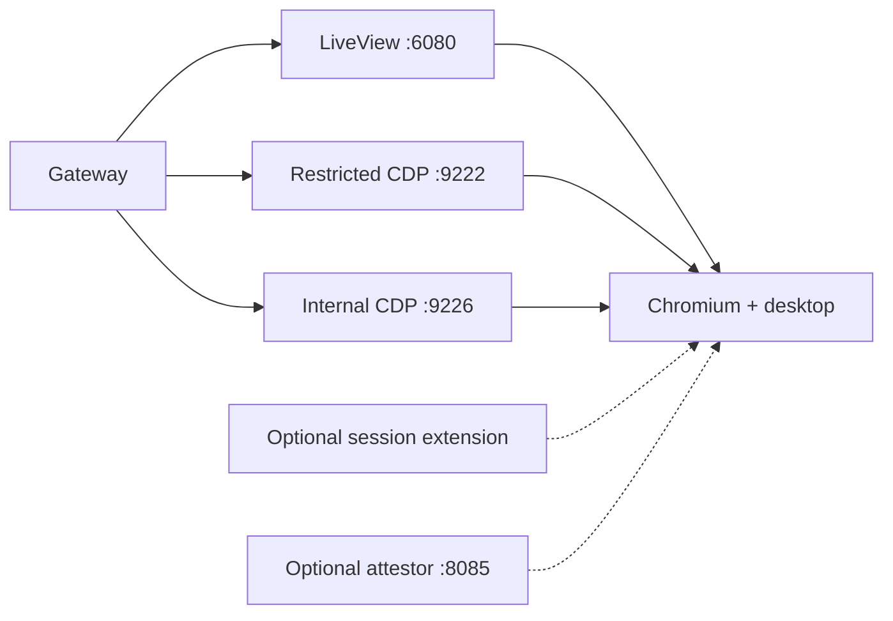

# Browser runtime

The browser runtime is the workload allocated for one session. It runs inside
an Agones GameServer pod and is disposable by design.

## Pod shape



The required container is `browser-runtime`. Optional extension and attestor
containers share its network namespace and can use loopback to reach the
browser proxies.

## Built-in ports

| GameServer port | Container port | Public gateway path | Access |
| --- | ---: | --- | --- |
| `novnc` | 6080 | `/liveview/...`, `/liveview-ws/...` | restricted session token |
| `cdp` | 9222 | `/cdp/...` | restricted session token and CDP command policy |
| `cdp-internal` | 9226 | `/cdp-internal/...` | internal token, full CDP |

All use Agones `portPolicy: None`. They are pod ports, not host ports. The
gateway routes to the pod IP recorded by the pool manager.

## LiveView

The runtime starts an X desktop, Chromium, and a small proxy serving the noVNC
client and RFB WebSocket bridge. The session response uses:

```text
url:      https://<gateway>/liveview/<session>/<token>/liveview.html?...
vncUrl:   same canonical LiveView page
vncWsUrl: wss://<gateway>/liveview-ws/<session>/<token>
```

The `vncUrl` and `vncWsUrl` field names are API compatibility names. LiveView
is built in and has no Helm mode switch.

## CDP surfaces

The runtime keeps Chromium's raw DevTools listener on loopback and exposes two
proxies:

- restricted CDP on `9222` applies the runtime/gateway command policy intended
  for client integrations;
- internal CDP on `9226` provides full DevTools access for trusted automation
  and same-pod services.

The optional `/cdp-agent` gateway route also provides full automation-scoped
CDP for the x402 lifecycle. Full CDP can control the browser completely; never
treat a path token as a harmless identifier.

## Browser image and startup

The maintained image lives under `images/minimal-vnc-desktop`. Its entrypoint
starts the desktop, window manager, Chromium, LiveView proxy, and CDP proxies,
then reports health to Agones.

Popcorn's browser engine is
[Tilion Fortress](https://github.com/tiliondev/fortress), an open-source
Chromium fork that corrects browser-fingerprint surfaces inside Chromium and
exposes the browser over CDP. Popcorn packages a digest-pinned Fortress image
with its desktop, LiveView, restricted-CDP, and full-CDP layers; it does not use
the Fortress SDK or MCP server. Browser coherence does not replace suitable
egress, session isolation, or responsible automation behavior.

The image is Linux/amd64. Production should pin it by digest and test the exact
image with the selected runtime class and security profile before rollout.

## Browser policy

`browserPolicy.variant` controls the managed search/new-tab policy:

- `neutral` is the OSS default;
- `reclaim-portal` opts into the bundled alternate policy.

`APP_URL` may still choose the initial page without changing the managed search
policy.

## Runtime environment

Add normal Kubernetes env entries through `extraBrowserRuntimeEnv`:

```yaml
extraBrowserRuntimeEnv:
  - name: APP_URL
    value: https://example.com
  - name: CLOAK_TIMEZONE
    value: Europe/London
```

Common groups include:

- startup: `APP_URL`, `CHROMIUM_FLAGS`, `READY_WINDOW_PATTERN`;
- persona: `CLOAK_*` and `TILION_*` variables;
- proxy/listeners: `NOVNC_PORT`, `CDP_INTERNAL_PORT`, `CDP_RESTRICTED_PORT`,
  `CDP_FULL_PORT`, and related addresses;
- egress: `HTTPS_PROXY_URL`, normally read from
  `browser-runtime-proxy-secret`.

## Country-routed proxy presets

Create a country-routed session by sending an uppercase ISO 3166-1 alpha-2
code in the standard session request:

```json
{
  "sessionId": "browser-42",
  "proxy": { "country": "IN" }
}
```

The pool manager expands the deployment-owned `HTTPS_PROXY_URL` template (both
`{{country}}` and `{{geoLocation}}` are supported), lowercases the country for
the upstream proxy, and appends `-session-<sessionId>` to the proxy username
before returning the session URL. Credentials and provider URLs are never
accepted from API callers.

For the request above and a template ending in `-country-{{geoLocation}}`, the
derived username includes `-country-in-session-` followed by the first 32 hex
characters of a SHA-256 digest of the complete session ID. This keeps the
provider's sticky-session token alphanumeric without collapsing distinct IDs
that differ only by punctuation or a long suffix.

The image-level reference in
[`images/minimal-vnc-desktop/README.md`](../images/minimal-vnc-desktop/README.md)
is authoritative for exact runtime variables.

## Security profiles

`browserRuntimeSecurityProfile` supports:

- `legacy`: preserves the current broad browser capability set, including
  `SYS_ADMIN`;
- `hardened`: drops all capabilities, disables privilege escalation, and uses
  the runtime-default seccomp profile.

`hardened` must be tested with the exact image and runtime class. The public
x402 deployment uses hardened containers with gVisor. A profile value does not
replace node isolation, egress control, resource limits, or short sessions.

## Resources and scheduling

Browser CPU and memory are configured under `fleet.*`. Requests control node
packing; limits bound individual sessions. Browser workloads can be placed on a
dedicated pool with `fleet.nodeSelector`, `tolerations`, and `affinity`.

The pod uses an in-memory `/dev/shm` volume capped at 2 GiB and an ephemeral log
volume. Neither is durable session storage.

## Service account and RBAC

When `serviceAccount.create=true`, the chart creates `browser-sa` with access to
its namespace's GameServers, events, its pod, and node metadata. The service
account token mount is configurable.

Agones may inject its own SDK sidecar and service account behavior. Review the
rendered Fleet when disabling the chart-created account or enabling restrictive
NetworkPolicy.

## Optional components

### Image pre-puller

`imagePrepuller.enabled=true` creates a DaemonSet on selected browser nodes to
pull the browser and enabled extension images before allocation.

### Attestor

`browserRuntimeAttestor.enabled=true` adds the attestor sidecar and requests the
`google.com/cc` device. It requires compatible confidential nodes and the
device plugin. See [Attestation](attestation.md).

### Session extensions

Extensions add keyed ports, sidecars, pre-pull containers, route mappings, and
optional response URLs. They are operator-owned services, not code compiled
into the OSS browser runtime. See [Configuration](configuration.md#session-extensions).

## Runtime checks

```bash
kubectl -n popcorn get gameservers,pods -l app=browser-runtime
kubectl -n popcorn describe fleet browser-fleet
kubectl -n popcorn logs <browser-pod> -c browser-runtime --tail=200
```

Use the gateway health and a real LiveView/CDP acceptance session to validate
the complete path; a Running pod alone does not prove the browser is usable.
