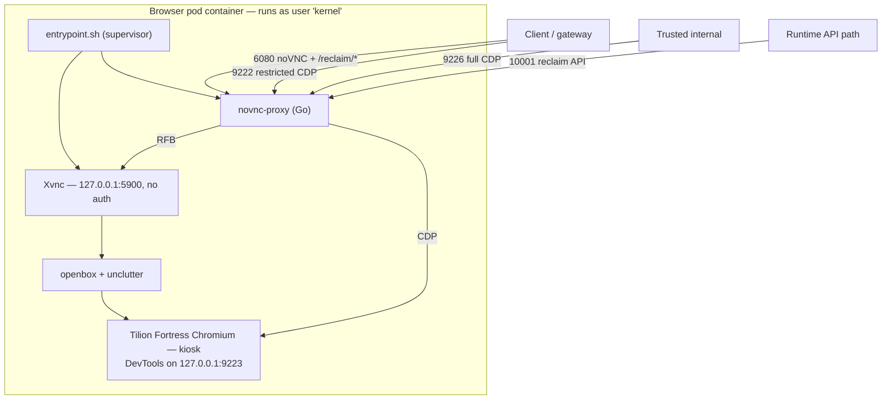

# The Popcorn Browser

> Companion document: [Popcorn Architecture](architecture.md).

The Popcorn Browser is the runtime that runs inside every browser session pod — the actual
Chromium a user drives, together with the streaming, control, and proof surfaces around it.
It is built from `images/minimal-vnc-desktop/`: a lean, self-contained image that boots fast,
presents a consistent desktop Chrome profile, and exposes the browser to the platform through a
single Go helper.

This document explains how that image is put together and how it runs — its build, its boot
sequence, the ports it serves, the browser it ships, and the helper that fronts it. It is a
reference to the runtime's mechanics — it describes what the browser does, including choices
such as a disabled Chromium sandbox or listeners without in-image authentication, without
judging them; guarantees and hardening live in separate documents. It is the companion to the
browser-runtime section of [`architecture.md`](architecture.md).

> Source references appear as `file:line`, mapping each section back into the image directory.

---

## Overview

A Popcorn Browser container holds four things: a virtual X display, a VNC server and its noVNC
web bridge, a hardened Chromium build ("Tilion Fortress"), and a Go helper (`novnc-proxy`) that
fronts VNC, CDP, and a Reclaim proof API. A single bash script supervises them.

The image is deliberately minimal — just the virtual display, VNC/noVNC, Chromium, and a small
Go helper, with none of the heavier runtime machinery (supervisor, Chromedriver, Playwright,
audio streaming). That restraint is the point: it boots quickly and keeps the surface small. This
is the runtime behind Popcorn's `liveview` streaming mode.

The container exposes ports `6080 9222 9226 10001`, runs as the non-root `kernel` user, and its
entrypoint is the supervisor script.

*Source: `Dockerfile:234-236`, `README.md:1-5`.*

---

## How it is built

The `Dockerfile` is a multi-stage, fully digest-pinned build designed to be reproducible. Four
stages feed the final image:

1. **Proxy builder** compiles the Go `novnc-proxy`. It is `CGO_ENABLED=1`, because the embedded
   Reclaim OPRF circuits require cgo.
2. **Ubuntu snapshot** takes a digest-pinned `ubuntu:22.04` and repoints apt at a frozen Ubuntu
   snapshot mirror, so package versions are fixed no matter when the image is built.
3. **Fortress** is the browser, pulled as a digest-pinned OCI image (`tilion/fortress`, tag
   `149` — stable Chromium 149.0.7827.232). It has no arm64 manifest, which makes the whole
   image **amd64-only**.
4. **Runtime** assembles everything else: the pinned apt packages (openbox, TigerVNC, Chromium's
   runtime-library closure), sha256-verified noVNC assets, the non-root `kernel` user, a curated
   set of international fonts, the Fortress overlay, and the image's own scripts, extension, and
   policies.

Two build-time decisions shape how the running browser behaves. The first is **font curation**.
Fortress ships only a handful of Latin Windows fonts, so the build copies in the international
script faces it needs, purges the bulky Noto packages, and rewrites Fortress's fontconfig so
each face is *enumerated* under the Windows font name a real Windows machine would use — Nirmala
UI for Indic scripts, Segoe UI for Arabic and Hebrew, Microsoft YaHei and its siblings for CJK,
and so on. Every script renders, and the enumerable font list reads as a coherent inbox-Windows
set. The second is the **Fortress overlay**: the build copies `/opt/tilion` into the image and
symlinks `chromium` to its launcher, so anything that invokes `chromium` gets the persona-wrapped
browser.

Reproducibility runs through the whole build. `SOURCE_DATE_EPOCH` normalizes timestamps, and
every input — base images, the Go toolchain, the Ubuntu snapshot, the Fortress digest, the noVNC
tarball, the Chromium deb artifacts — is pinned by digest or checksum. The build must run
natively on amd64; Chromium crashes under QEMU emulation.

*Source: `Dockerfile:1-236`, `locks/`, `README.md:242-259`, `FORTRESS-INTEGRATION.md:9-11`.*

---

## How it boots

`entrypoint.sh` is a single bash supervisor — there is no supervisord — that starts the
session's processes in sequence and binds their lifetimes together:

1. It resolves configuration from the environment, exports the display and profile paths, and
   creates the working directories.
2. It routes all output through `tee` into `entrypoint.log` and container stdout. This is how the
   Go helper's logs, proof lifecycle records, and Reclaim-TEE library output reach Kubernetes and
   OpenTelemetry.
3. It wires up the **Agones lifecycle** when running under Kubernetes — sending `ready`,
   `health`, and `shutdown` to the Agones SDK sidecar — and installs a trap that signals shutdown
   and tears down every child on exit.
4. It starts **Xvnc** on `127.0.0.1:5900` with no VNC authentication (`SecurityTypes None`); the
   only way in is the noVNC WebSocket bridge.
5. It starts the **`novnc-proxy`** helper and waits for its listeners.
6. It starts the **openbox** window manager and hides the pointer with `unclutter`, baking it out
   of the framebuffer server-side.
7. It launches the **application** — `start-chromium` by default — and polls the X window tree
   until a window matches the readiness pattern. Until then, the proxy's HTTP and WebSocket routes
   return `503`. Once the browser is up, it signals Agones ready and waits on the children; if any
   exits, the container exits and cleanup runs.

*Source: `entrypoint.sh:40-295`.*

---

## Ports and listeners

The image presents a small, deliberate set of listeners. Everything a client or the gateway
touches passes through the Go helper; Xvnc and Chromium's raw DevTools bind to localhost and are
never exposed directly.

| Port | Bind | Served by | Purpose | In-image auth |
| --- | --- | --- | --- | --- |
| 5900 | localhost | Xvnc | Raw RFB / VNC | none (`SecurityTypes None`) |
| 6080 | all | novnc-proxy | noVNC HTTP + `/websockify` + `/reclaim/*` | none |
| 9222 | all | novnc-proxy | Restricted CDP (command allow-list) | none |
| 9223 | localhost | Chromium | Raw DevTools upstream | none (localhost only) |
| 9226 | all | novnc-proxy | Full CDP (unfiltered) | none |
| 10001 | all | novnc-proxy | Dedicated Reclaim API | none |

The listeners that bind to all interfaces are gated by the gateway and Kubernetes networking, not
by the process. Each is configurable, and the CDP and Reclaim listeners can be disabled by setting
their listen address to empty.

*Source: `entrypoint.sh:10-15`, `proxy/main.go:33-40`.*

---

## The browser: Tilion Fortress

The `chromium` command is **Tilion Fortress**, a hardened fork of stock Chromium 149. Popcorn
pins the stable channel rather than the newest build so the browser matches the version most real
users run. `/opt/tilion/tilion` is a small launcher that wraps the patched binary and applies a
consistent desktop **Windows profile** before the first renderer tick.

The profile's job is to keep the browser's reported identity internally consistent. Platform,
user-agent, client hints, hardware attributes, fonts, timezone, and locale are all presented as a
coherent Windows desktop, and the automation markers a plain headless launch would expose are
removed. Timezone and locale are supplied by `start-chromium` and applied at both the JavaScript
and process level, so page-side date and locale behavior lines up with the rest of the profile.

Fonts are part of that consistency: the build renames the curated font faces to their Windows
equivalents (see [How it is built](#how-it-is-built)), so the enumerable font list matches the
platform the browser reports.

The profile is configurable. `CHROMIUM_FLAGS` overrides individual attributes, and an opt-in
alternative browser (`fingerprint-chromium`) is selectable via `BROWSER=fingerprint`, using a
different flag dialect.

*Source: `STEALTH.md`, `FORTRESS-INTEGRATION.md`, `Dockerfile:148-215`.*

---

## The launcher: start-chromium

`start-chromium` turns the Fortress binary into a running session, and it is where per-session
identity and behavior are assembled. In order, it:

- **Chooses the start page** — the Reclaim loading page by default, or a fallback, overridable by
  environment.
- **Seeds the profile.** If a `CLOAK_PROFILE_SEED` tarball is supplied and the profile is empty,
  it is extracted, letting a session start pre-warmed and pre-authenticated with cookies, local
  storage, and a persisted fingerprint seed. The code treats the bundle as a credential.
- **Fixes a fingerprint seed** — from the environment, a persisted file, or a fresh CSPRNG value —
  and persists it, so the identity is stable across restarts.
- **Resolves timezone and locale** from the egress IP via a boot-time geo-IP lookup and aligns the
  OS timezone to match, so date and locale behavior in the page is consistent with the session's
  location. The control plane later re-aligns the timezone to the session's proxy exit over CDP.
- **Preserves third-party cookies.** On every boot it opts out of Chromium's third-party-cookie
  deprecation and sets the profile's cookie-controls preference to allow them, so cross-site
  cookies that some sites depend on keep working under newer Chromium defaults.
- **Assembles the launch flags** and executes the browser.

The launch flags bind DevTools to `127.0.0.1:9223`, point the profile at `$HOME/user-data`, run
the browser in kiosk mode at the display resolution, and disable Chromium's own sandbox
(`--no-sandbox --disable-setuid-sandbox`). When the proxy extension is enabled, the flags scope
Chromium to load only that one extension. Operator-supplied `CHROMIUM_FLAGS` are appended last.

*Source: `start-chromium:1-300`.*

---

## The helper: novnc-proxy

A single Go binary fronts three surfaces, so the outside world never touches Xvnc or raw DevTools
directly.

**noVNC (port 6080)** serves the noVNC web client and bridges its WebSocket — `/websockify`,
`/vnc-ws/`, `/liveview-ws/` — to the local VNC server. Static routes stay behind the readiness
gate, returning `503` until Chromium's window is up. The Reclaim API is served here too.

**CDP comes in two tiers.** Both bridge to Chromium's raw DevTools on `127.0.0.1:9223` and rewrite
the debugger URLs they return so clients stay pointed at the proxy.

- **Full CDP (port 9226)** forwards every command unmodified — complete remote control of the
  browser — and is meant for trusted internal routing only.
- **Restricted CDP (port 9222)** exposes the discovery endpoints and filters WebSocket commands to
  an allow-list; anything else is rejected with a CDP error, and non-text frames are dropped. The
  allow-list is scoped to the client interaction path:

  | Domain | Allowed methods |
  | --- | --- |
  | Input | `enable`, `insertText`, `dispatchKeyEvent`, `dispatchMouseEvent`, `dispatchTouchEvent` |
  | Emulation | `setDeviceMetricsOverride`, `setVisibleSize`, `setTouchEmulationEnabled`, `clearDeviceMetricsOverride` |
  | DOM | `enable`, `getNodeForLocation`, `describeNode` |
  | Browser | `getVersion` |
  | Target | `setAutoAttach`, `attachToTarget`, `closeTarget`, `getTargets` |
  | Page | `enable`, `reload` |

**Reclaim API (ports 10001 and 6080)** is backed by the pinned `reclaim-tee` client and embedded
OPRF circuits. `POST /reclaim/prove` runs a full Reclaim TEE proof — a 10 MB body limit, a
five-minute timeout, TEE endpoints resolved through configurable defaults — and returns the claim,
attestation context, and attestor signatures. `POST /reclaim/validate` (and its
`/validate-extraction` alias) runs the lighter extraction pipeline, checking that a supplied
response body yields an expected value under a given xPath, JSON path, or regex (a 50 MB body
limit), and returns the extracted value, redaction ranges, and per-step diagnostics without a full
proof.

*Source: `proxy/main.go:33-127,591-641`, `proxy/reclaim.go`, `proxy/reclaim_validate.go`.*

---

## The proxy extension

Each session browses through its own upstream proxy, and that proxy is applied **inside
Chromium** by a bundled extension rather than by the container's network configuration. This is
what lets every session use a different exit — a per-user residential or mobile proxy — from one
shared image, and lets the proxy be swapped mid-session without restarting the browser.

**How the proxy is used.** The image ships a small MV3 extension whose only job is to manage the
browser's proxy setting. It works in three parts:

1. **The setting.** The extension's background service worker calls `chrome.proxy.settings` in
   `fixed_servers` mode with a single upstream — scheme, host, and port — and a bypass list that
   defaults to localhost. It persists that configuration to `chrome.storage.local` and re-applies
   it every time the service worker restarts, so the proxy survives Chromium's worker lifecycle.
2. **Assigning it at runtime.** The platform sets the proxy after the session starts. A content
   script injected into every frame bridges `window.postMessage` to the background worker, and an
   injected script exposes a frozen `window.__pcn` object with `set`, `clear`, and `get`. The
   platform assigns or changes the upstream by invoking `window.__pcn.set({...})` in the page —
   in practice driven over CDP — which routes to the worker and updates the proxy setting. The
   property name is intentionally low-profile.
3. **Credentials.** The upstream proxy's username and password are **not** handled by the
   extension. They are supplied out of band over CDP (the `Fetch` domain answers the proxy's auth
   challenge), so credentials never live in the extension, in `chrome.storage`, or in the page.

The net effect: the extension carries only the non-secret proxy endpoint, the platform assigns it
per session over the same CDP channel it uses to drive the browser, and the secret half of the
credential stays on the control side. Egress from the session then flows through that upstream,
except for the handful of boot-time calls (`start-chromium`'s geo-IP lookup and the Reclaim TEE
endpoints) that run before or outside the proxy.

*Source: `extensions/proxy/manifest.json`, `background.js`, `content.js`, `injected.js`.*

---

## Policies and live view

**Managed Chromium policies** ship in two variants, applied through
`/etc/chromium/policies/managed`. Both disable the password manager, autofill, and translate;
block notifications and geolocation by default; allow third-party cookies for Google and reCAPTCHA
origins; and permit extension installation from any source. They differ only in the default search
and new-tab destination — DuckDuckGo in the default, the Reclaim portal in the variant, which
`start-chromium` swaps in when the Reclaim start page is enabled.

**Live view** is a small noVNC RFB client served as `liveview.html`. It derives its WebSocket URL
from the page path (or an explicit `path` parameter), which is how the gateway's
`/liveview-ws/{sessionId}/{token}` route is wired in, and it supports the usual noVNC options for
scaling, reconnect, and view-only mode. It forces the viewer-side cursor to show, since the
server-side one is hidden.

*Source: `policies/`, `liveview.html`.*

---

## Configuration

The browser is configured entirely through environment variables, grouped by concern: the
application and display (command, start URL, dimensions, readiness), the ports and listen
addresses, the extension and policy paths, the Agones SDK connection, the Reclaim endpoints and
timeouts, and the stealth persona knobs (`CLOAK_*`, `TILION_*`, and `BROWSER`). The full table is
in the image's [README](../images/minimal-vnc-desktop/README.md#runtime-configuration).

*Source: `README.md:170-211`.*

---

## Verifying the browser profile

Two harnesses check that the browser's reported profile is internally consistent, both driving it
over the **full** CDP port — the restricted port filters out the commands the checks need.
`stealth-tests/` is a Node/Playwright suite, and `scripts/stealth-test.sh` is a dependency-light
battery that reads results directly over CDP.

*Source: `STEALTH.md`, `scripts/`, `stealth-tests/`.*

---

## How it fits the platform

The pod runs under Agones, and the entrypoint drives the Agones lifecycle so the fleet can
allocate and reap it. The gateway routes the live-view HTTP and WebSocket paths to port 6080 and
the CDP paths to the restricted and full CDP ports, resolving the pod from Redis as described in
[`architecture.md`](architecture.md); the internal-scope CDP route maps to the full CDP port. Once
a session is assigned an upstream proxy, the browser egresses through it, with a few boot-time calls
going out directly.

---

## Related documents

- [Popcorn Architecture](architecture.md) — the platform-wide architecture.
- [Documentation index](index.md) — operator documentation.
- [image `README`](../images/minimal-vnc-desktop/README.md) — build, run, and full configuration.
- [`STEALTH.md`](../images/minimal-vnc-desktop/STEALTH.md) — the stealth threat model and probe results.
- [Security](security.md) — operator hardening checklist.
